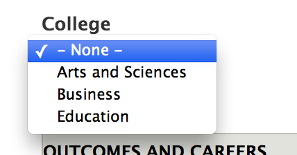
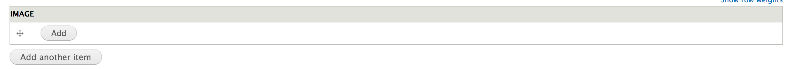
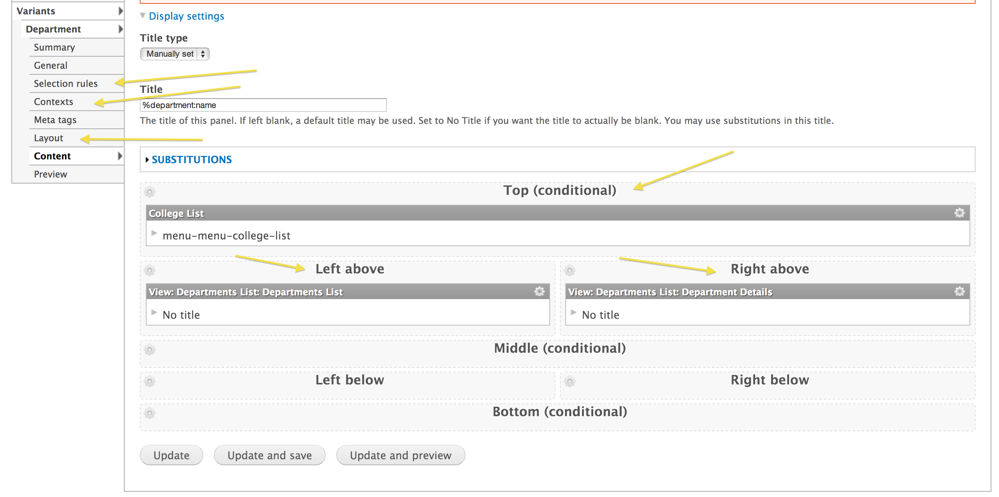
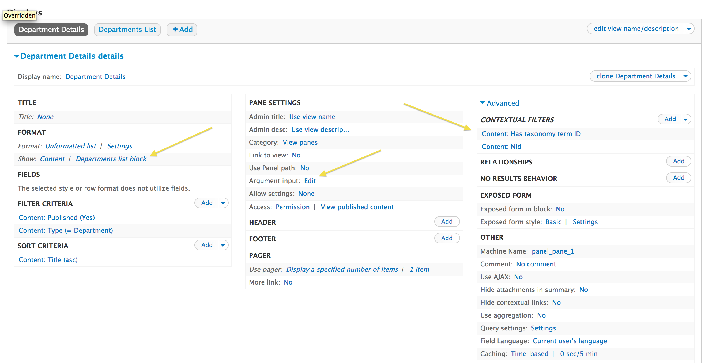
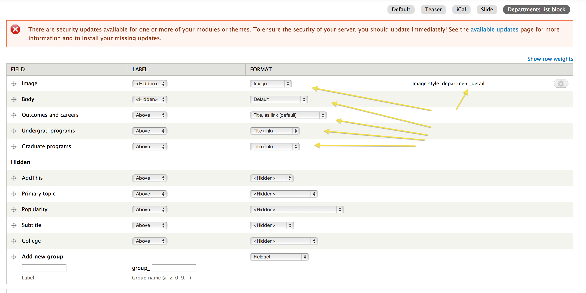
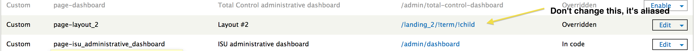
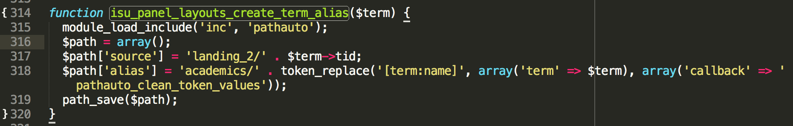
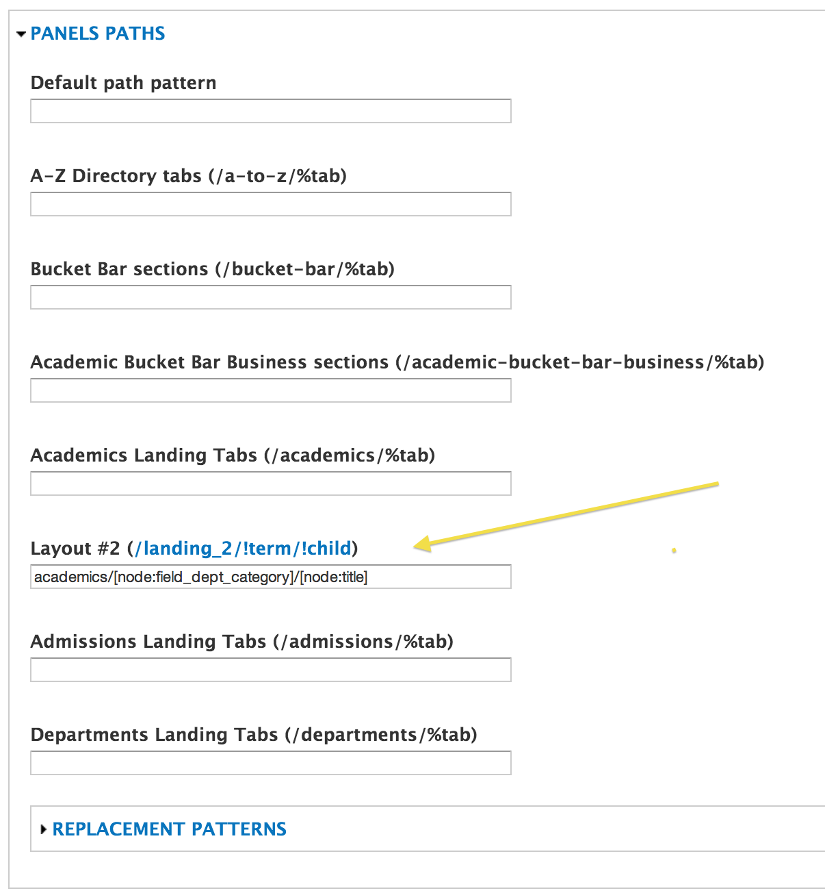

# Academics landing page

1. [Structure](#structure)
2. [How it's different](#how-its-different)
3. [How it works](#how-it-works)
4. [How to add content](#how-to-add-content)
5. [What should be edited](#what-should-be-edited)
6. [What shouldn't be edited](#what-shouldnt-be-edited)
7. [Paths](#paths)

## Structure

*** Lest you be confused, during development this landing page was called the "Departments" landing page. As a result, the machine names for a lot of the components are called "departments" rather than what you're probably expecting, "academics".

The academics landing page features a dynamic colleges and departments hierarchy whereby colleges are selected and the departments within that college dynamically populate. Equally so, when a department is selected the department dynamically populates.

This effect is achieved by hooking into the ordinary Drupal tools we're accustomed to using and adding custom functionality to them that make this dynamic interaction happen via ajax. The landing page uses a panels page to handle the layout, views to handle retrieving and formatting the html when it is dynamically retrieved, a menu generated from taxonomy terms for the colleges listing, and url aliases for handling the correct paths so that the tool is nojs compatible.

- [Panels page](http://cms.indstate.edu/admin/structure/pages/edit/page-layout_2)
- [View](http://cms.indstate.edu/admin/structure/views/view/departments_list/edit)
- [Menu](http://cms.indstate.edu/admin/structure/menu/manage/menu-college-list)
- [Taxonomy](http://cms.indstate.edu/admin/structure/taxonomy/college)
- [Url aliases](http://cms.indstate.edu/admin/config/search/path)

By adding javascript and a few other custom components, we're able to get the dynamic effect without making the entire rendered page be custom. What this means is that we can still use the Drupal components listed above and allow a certain level of administrative configuration to take place.

## How it's different

This setup is different than other landing pages in the site because there are custom components hooked into it that allow it to be dynamic. The user interface is dynamic, but the actual content population is also dynamic. For instance, instead of manually creating little blocks for each region and using quicktabs to create tabs that allow a certain degree of dynamicity to the user interface, this uses the departments content type, the colleges taxonomy, and the college list menu to populate the content. This means that content administrators will spend less time configuring the panel content within the layout and more time just focusing on creating and curating content.

## How it works

There are 3 main components that make up how the dynamic portions of this landing page works.

1. College menu
2. Departments listing
3. Departments detail

When a college taxonomy term is added to the college list menu, it will automatically show up as a new tab on the tab bar. When a college is selected it retrieves a list of department nodes that have been linked to that college taxonomy term. It simultaneously retrieves an individual department detail node and displays it as well.

If the page loads without a college specified, it randomly selects a college and highlights it. If the page loads without a department specified, it randomly selects a department within the college that's been selected.

### Dynamic content

The dynamic content is retrieved via ajax when a college or department is selected so long as the browser has javascript enabled. The way this works is there is custom javascript added to the page to place an http request to a specific endpoint that was setup to handle this ajax content. The endpoint retrieves the request, renders the departments list and departments details views and returns them via ajax to the browser. The javascript then parses the content and places it in the appropriate location.

While the dynamic content is being retrieved and replaced, there is a spinner icon that appears to indicate to the user that new content is being retrieved. When the content returns and renders, there is a brief highlight effect that occurs to indicate to the user that the operation is complete.

## How to add content

Since this landing page is more dynamic, less time needs to go into configuration and more time needs to go into content creation and curation. There are two pieces of content that need to be created for this feature

1. College taxonomy terms
2. Department nodes

### College taxonomy terms

To add a new tab to the colleges tab bar, you need to add a new taxonomy term to the "colleges" vocabulary:

[Add new term](http://cms.indstate.edu/admin/structure/taxonomy/college/add)

Once the term is created, you need to make sure it appears in the "college-list" menu:

[College list menu](http://cms.indstate.edu/admin/structure/menu/manage/menu-college-list)

Once it appears and is enabled in the menu, it will show up as a new tab in the academics landing page.

### Department nodes

To add a new department to a college so it shows up in the department listing and department detail, you need to add a new department node:

[Add new department](http://cms.indstate.edu/node/add/department)

In the department node form, you must assign the correct college within which the dpeartment falls in order for it to show up in the appropriate listing.

You also must ensure that you add an image to the department so that the department detail appears properly.

## What should be edited

Since this dynamic landing page was able to be developed using common Drupal components, there are a number of elements that can be configured and changed. The following can be safely modified:

- Banner content
- Middle panel layout region
- Left below panel layout region
- Right below panel layout region
- Bottom panel layout region

### Panel page configuration

Each of these elements are static and will not change in context of which college or department is selected.

## What shouldn't be edited

Since this is a dynamic landing page with custom coded functionality, there are some elements that should not be changed. If these elements are configured differently, the dynamic functionality will break in most cases.

- Top panel layout region
- Left above panel layout region
- Right above panel layout region
- Panel layout (needs to remain Two column brick)
- Panel selection rules
- Panel contexts
- Panel path and arguments
- Views arguments
- Department listing view mode

### Panel page configuration

### View configuration

### View mode configuration

## Paths

The academics landing page makes heavy use of url aliasing, which is the "proper Drupal way" of abstracting out and decoupling public facing aliases from system paths. This is probably one of the most important distinctions that must be understood between how this landing page works and how more basic landing pages work.

While with other landing pages you would edit the actual path of the panels page to match the desired public facing path, with this landing page you do *not* do this. Instead of editing the path directly, an alias is setup.

So, even though the academics landing page panel page is set to the path

/landing_2

it shouldn't be changed because there is an alias set for this system path as

/academics

In order to make this landing page feature functional both without javascript and with unique urls to each component of the feature (each college has a path and each department has a path), the second and third levels in the path are also aliased. These aliases are created automatically when the content is created. So, when a new taxonomy term in the colleges taxonomy is created, an alias is created:

/academics/[new college term title]

When an individual department node is created, an alias is created:

/academics/[college term title within which this department resides]/[department node title]

The end result is that visiting any level in this path pattern takes you to the appropriate end result:

- /academics
- /academics/[college]
- /academics/[college]/[department]

### Technical details (aliases)

The top level alias for /landing_2 is manually created. The custom module code does not attempt to create this alias.

The second level alias for /landing_2/!term is created in isu_panel_layouts.module on term insert and update. It is hardcoded to the "academics/[term name]" pattern. This is a bit of a weakness in that it cannot be configured in the admin, but in the time allotted we weren't able to come up with a clever approach to handling this simply.

The third level alias for /landing_2/!term/!child is created in isu_panel_layouts.module on node insert and update. However, unlike the second level above, the pattern itself is *not* hardcoded. Instead, it uses the url alias pattern settings page to add a section for dynamic, custom panels pages:

[/admin/config/search/path/patterns](http://cms.indstate.edu/admin/config/search/path/patterns)

