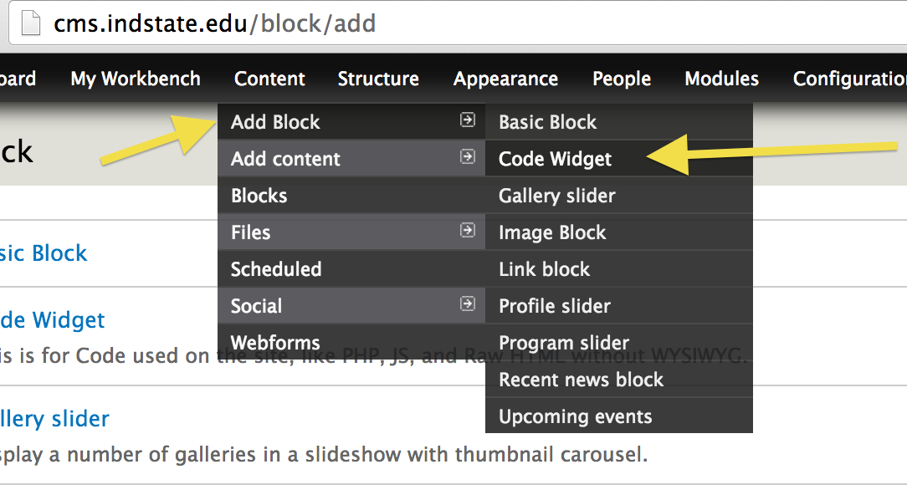
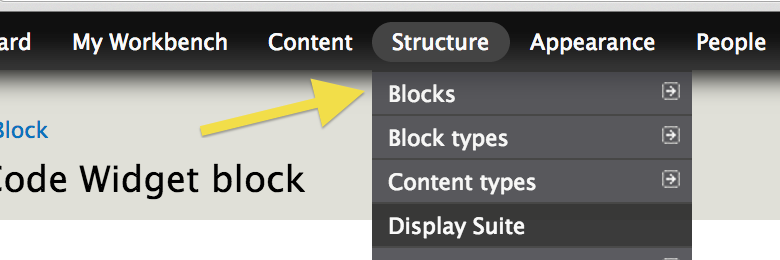
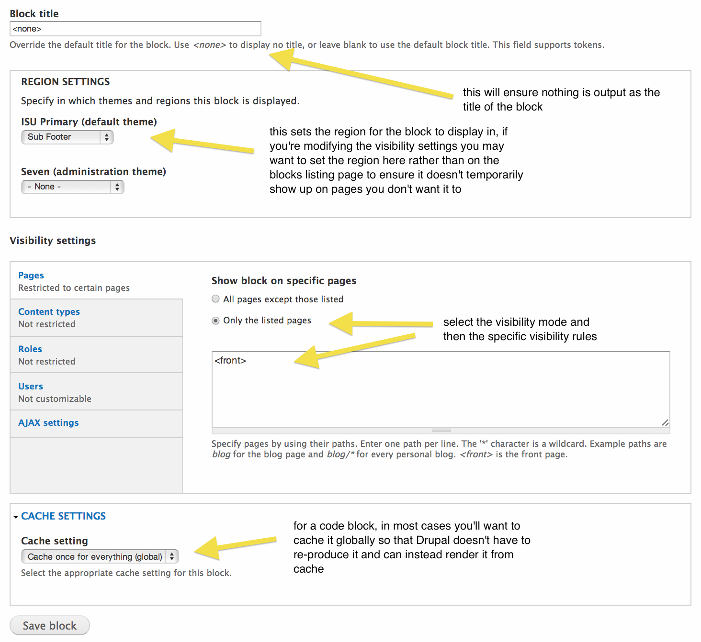

# Adding scripts using code block

* [What are code blocks?](#what-are-code-blocks)
* [Creating the code block](#creating-the-code-block)
* [Place your code block](#place-your-code-block)
* [Updating your code block](#updating-your-code-block)
* [Notes on performance](#notes-on-performance)


## What are code blocks?

One of the types of blocks that can be created in the site is called a "Code Widget". The intended use of this block type is to be able to add blocks that contain scripts and use them where needed in the site. One of the use-cases where this is handy is when you need to add a tracking script to the page. By creating a block with this script in it, you can control where the block is employed in the site using the block rendering and visibility system.

For example, let's say you are given a tracking script to add to all pages on the site.

```
<script type="text/javascript">
adroll_adv_id = "";
adroll_pix_id = "";
(function () {
var oldonload = window.onload;
window.onload = function(){
   __adroll_loaded=true;
   var scr = document.createElement("script");
   var host = (("https:" == document.location.protocol) ? "https://s.adroll.com" : "http://a.adroll.com");
   scr.setAttribute('async', 'true');
   scr.type = "text/javascript";
   scr.src = host + "/j/roundtrip.js";
   ((document.getElementsByTagName('head') || [null])[0] ||
    document.getElementsByTagName('script')[0].parentNode).appendChild(scr);
   if(oldonload){oldonload()}};
}());
</script>
```

You can take this script and paste it into a Code Widget block, and then place that block in the site.

## Creating the code block

In order to use the code block, you first need to create one.

In the Administration Menu, navigate to:

    Content > Add Block > Code Widget - /block/add/imagex-widget-code



Fill out the block creation form. Make sure:

- to give a meaningful administrative title to the block for ease of finding it later
- to leave the title blank if you don't want the end user to see anything visible from this block
- to select the "No filters" text format so that the script isn't stripped away upon saving it


## Place your code block

To get your newly created block with your tracking script to be output to the site pages, you now need to place the block. This can be done in many different ways in Drupal using a variety of different rendering approaches. However, the simplest way is to add the block to the core block system of the site.

Navigate to the blocks administrative page:

    Structure > Blocks - /admin/structure/blocks



Scroll down and find your newly created code block (look for the administrative title you gave to the block in the "Label" field). Once you find the block, set its region to "Sub Footer".


Once it's saved, your code block will be present on all pages of the front end of the site. If you want to control where the block is present, for instance if you need it to be no the homepage but on no other pages, select the "configure" link on the block and set specific visibility settings.




## Updating your code block

In the Administration Menu, navigate to:

	 Content > Blocks - /admin/content/blocks


Find your block and click "edit". Use the filters if it helps to narrow down the blocks.


## Notes on performance

Code blocks should be used sparingly because adding scripts to the page impacts performance. When at all possible, visibility settings should be used to restrict the scope of the impact of the script. In most cases, the code blocks should be added to the footer region as far down in the page as possible so that the script does not hold up and slow the page rendering. If many code blocks are created, they should be audited periodically to ensure they're removed when they're not in use.


<p style="margin-top:150px; text-align:right; font-size:90%;">Created on February 19, 2014<br />
Last modified on February 19, 2014<br />
Authored by Kevin Champion</p>

