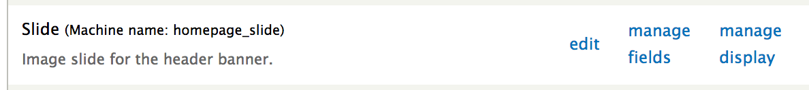
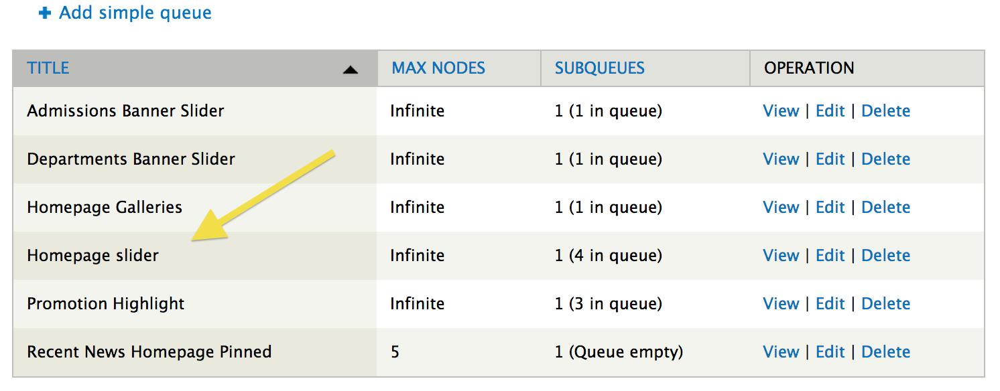
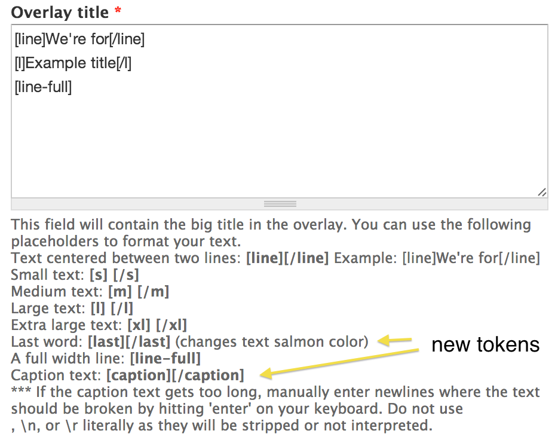
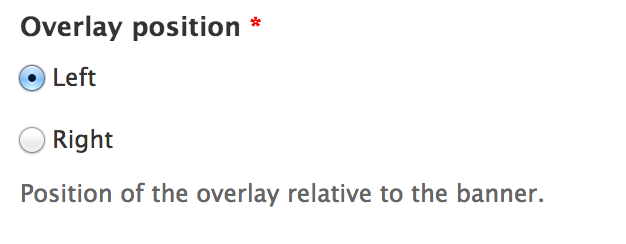
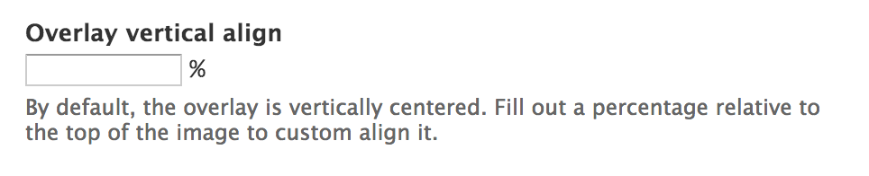
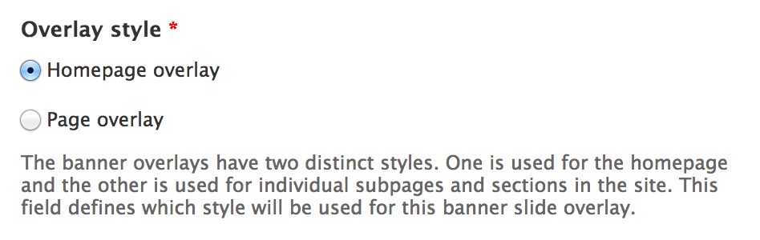

# Banner Slides

1. [Structure](#structure)
2. [Changes](#changes)
3. [How it works](#how-it-works)
4. [Add a new banner slider](#add-a-new-banner-slider)

## Structure

The banner slides are structured using their own content type called "Slide" (machine_name: homepage_slide). Any banner image that needs an overlay text box must be created as a slide node. To power a slideshow, there are two other components that are used: a nodequeue and a view. The nodequeue gathers a collection of nodes and orders them. The view takes the nodes from the queue and renders them as slider slides in a block. The block that the view creates can then be placed in a region and given visibility rules to control output location.

## Changes

The original site launch contained only one banner slider style and contained a separate caption field for writing the textual caption beneath the main text overlay section.

As of 10/14/2013, the banner slides contain two overlay styles and the caption field has been removed. In addition, a link field has been added and extra tokens for the banner title field have been configured. The banner overlay now links the entire overlay box if a link is entered into the link field. The caption is now written wrapped in a [caption] token in the title field. Lastly, there's now a style field with the options of "home" and "page".

### Home style

### Page style

## How it works

The slide nodes require an image and a textual message for the banner overlay.

### Title

The title field of the node is for internal administrative use only.

### Image

The image field is for uploading the actual banner image.

### Link

The link field is for applying a link to the entire banner overlay area. If a link is not present, the overlay will not link anywhere. This is different than the previous caption technique which only linked content within the separate caption field.

### Overlay title

The banner overlay content comes from the "Overlay title" field. This field has a number of token replacements for building the textual overlay content. In essence, these tokens are replaced by html elements with classes that allow for targeting the elements using css selectors in order to style them. The description of the field describes the token options and gives examples of how to use them.

With the new changes, the caption field content should be placed inside the [caption] token wrapper. For the "page" style overlay, the [last] token wrapper should be placed around the last word in the overlay title in order to change the text color of the last work to match the design specification.

### Overlay position

The overlay position field determines whether the overlay will be aligned on the left or right side of the banner image.

### Overlay vertical align

The overlay vertical align field determines the vertical placement of the overlay within the banner image area. This uses the "vertical-align" css property and the value of this field should be a percentage.

### Overlay style

The overlay style determines which style overlay will be used. The "home" style features the Arvo font and has all white text and lines with a tight padding and margin. The "page" style features the Helvetica font and has light blue features and a salmon colored title text color with wider padding and margins.

## Add a new banner slider

The process of adding a new banner slider, that is an entirely new slideshow for placement in a new section of the site, requires three steps.

1. A new nodequeue must be created
2. A new view display must be created
3. The new block must be placed with appropriate visibility settings

### Nodequeue

In order to control which slides will be used and what order they'll display in, a new nodequeue must be created. From /admin/structure/nodequeue select "Add simple queue":

Fill out the configuration form for creating the new queue and make sure to restrict the content type to only allow "Slide" nodes to be added to the queue.

### View display

In order to render the slides in the nodequeue as a slideshow, a views block display is used. From /admin/structure/views/view/homepage_slider/edit review the view that renders the slideshows. Clone the homepage slider display and then modify the titles and options of the new display to match the subject of your new slider.

After cloning the display, the most important detail that must be changed is configuring the relationship to use the new nodequeue. In the "advanced" column under the "Relationship" heading, select the "Nodequeue: Queue" item.

Within the configuration settings window, change the setting to limit the results to the new Nodequeue that you created in the step above. If this isn't changed, the new views display will render the items from a different Nodequeue.

Save the configuration and the view.

### Block placement

When you saved the new view display, it automatically generated a new block on the block placement configuration page located at /admin/structure/blocks. Find the newly created block, configure its visibility settings to restrict it to only display when and where you need it to, and place it in the "Banner" region.

