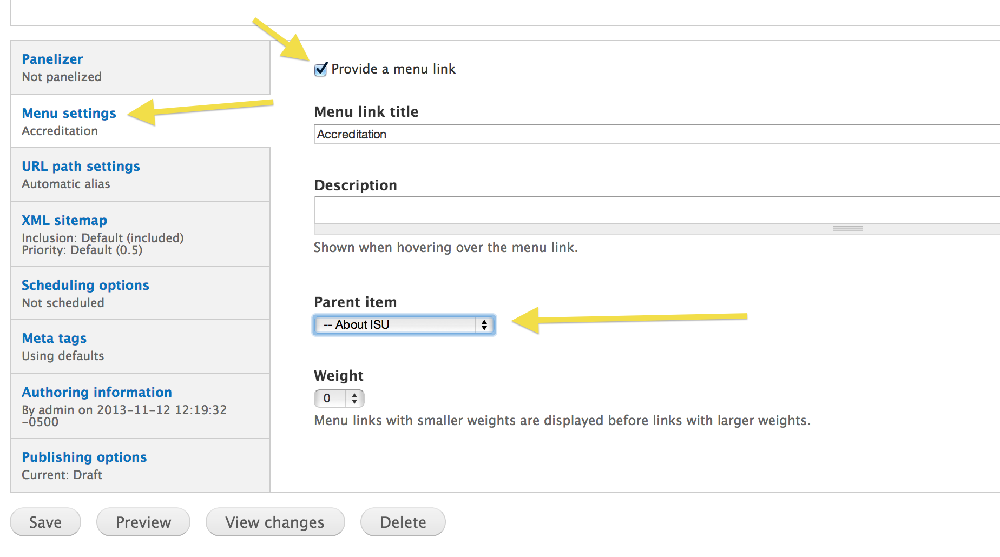
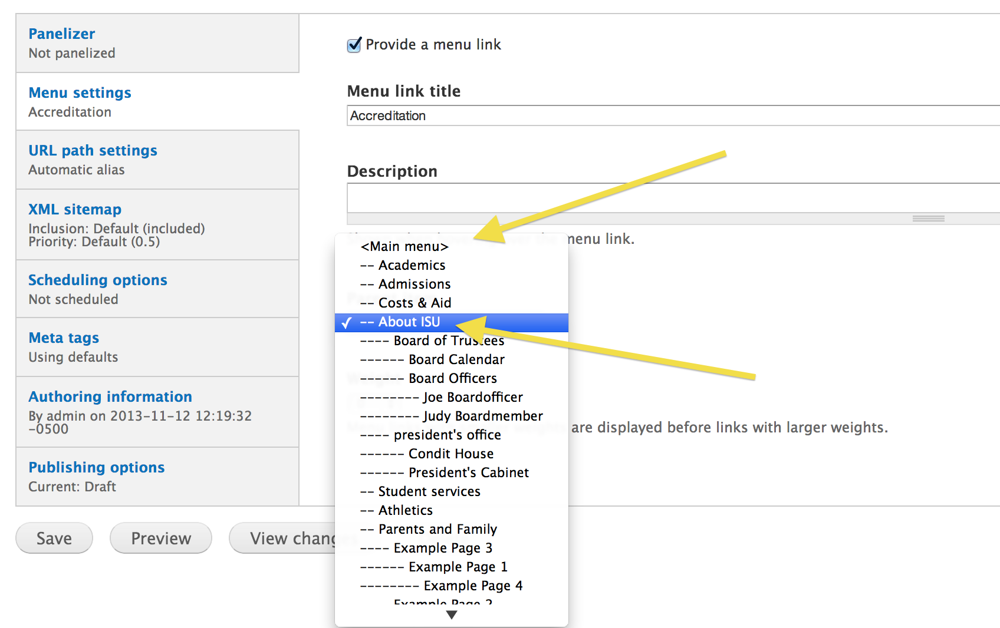
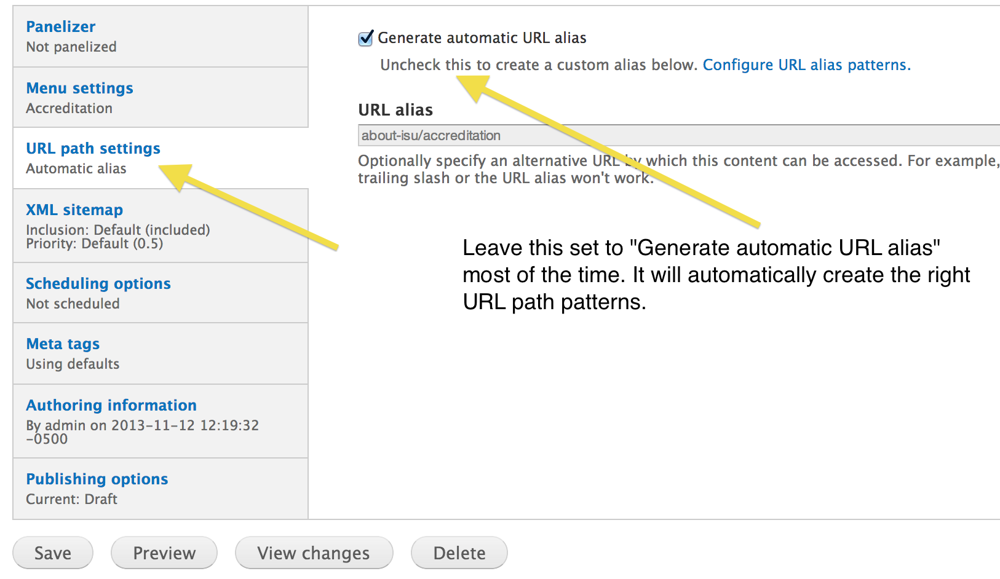
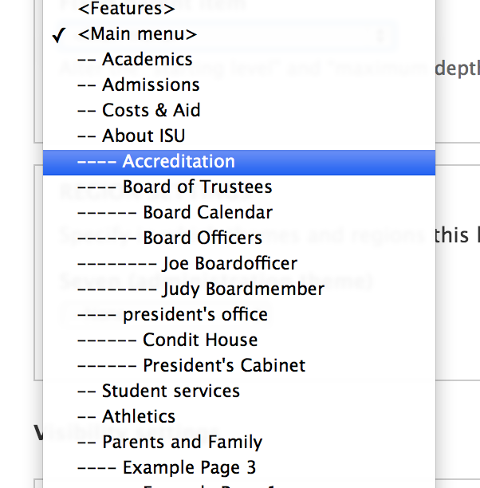
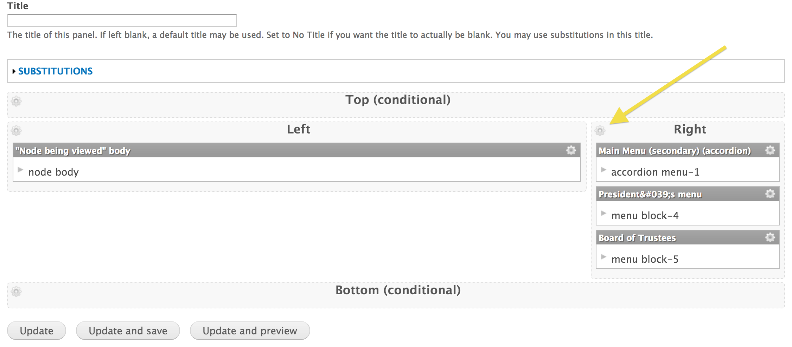
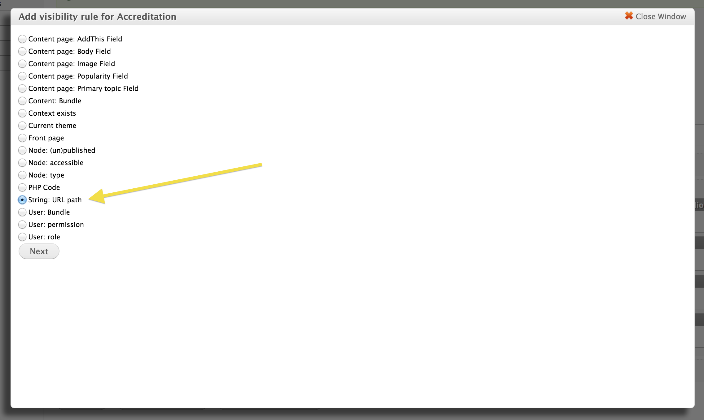
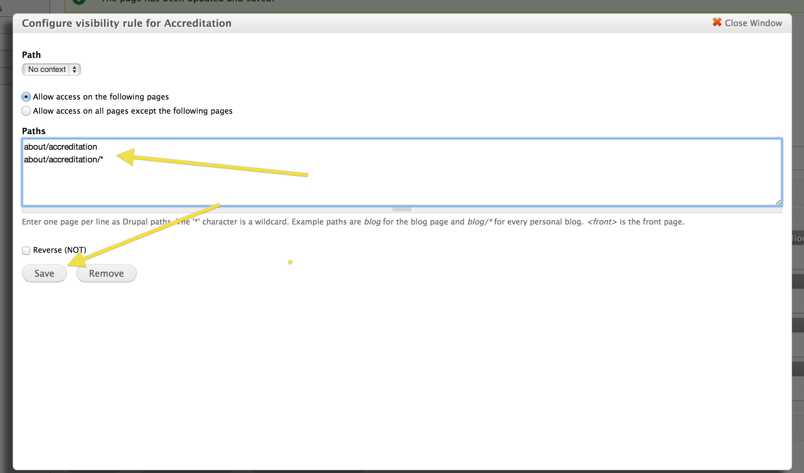
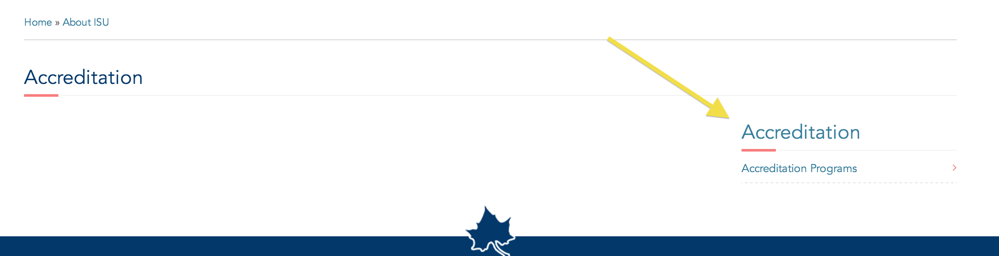

# Basic Page Menus

The ISU main site contains many "sub-sites", which are smaller sections within the site that fit within the whole site hierarchy, but are self-contained sections of the site. For instance, "Office of the President" is a sub-site that's located within the "About" section of the site. These sub-sites need their own controlled navigational menu that appears on basic pages. This documentation describes how to set these menus up.

- [Menu placement](#menu_placement)
- [URL patterns](#url_patterns)
- [Menu block creation](#menu_block_creation)
- [Menu block placement](#menu_block_placement)

## Menu placement

The first step in the process is to create a piece of content using the basic page content type. In the meta-data fields at the bottom of the creation form, the most important section for content writers and editor will be to configure a menu item for the page.

1. Select the "Menu settings" tab.
2. Check the box to "Provide a menu link"
3. Fill out the "Menu link title" and "Description" fields
4. Select the "Parent item" the current page should fall under

Once this is done, when the page is published, a new menu item will appear in the location you set it there.

> This step can be done by content writers and editors.

## URL patterns

The second step in the process is to ensure that the page's url path fits properly in the path structure hierarchy of the sub-site you're creating. The path structure should be such that you have a parent page that represents the sub-site homepage and any sub-site inner pages will be placed under that path.

####For example

- sub-site home: `/about/accreditation`
- sub-site inner: `/about/accreditation/accreditation-programs`

The url alias path can be manually overwritten in the page metadata tab entitled "URL path settings". However, in most cases this is unnecessary.

Drupal has path alias patterns that are configured as the defaults. For the basic page content type, the default pattern is to use the menu link structure to determine the path. When using the example above, if you are creating the "Accreditation Programs" inner page to the "Accreditation" sub-site, you only need to ensure that the menu item properly selects the "Accreditation" page as its parent menu item. The resultant path will be automatically created as:

`/about/accreditation/accreditation-programs`

> This step can be done by content writers and editors.

## Menu block creation

After creating the basic page nodes to fill out the content pages of the sub-site (or at any point after the parent homepage of the sub-site is created), you'll create a menu block specific to this sub-site. This menu block will be configured to filter the main menu to only display the menu items inside the sub-site.

To do this, navigate to the add menu block form:

`/admin/structure/block/add-menu-block`

In this form, set it up to display your sub-site menu inside the main menu. You do this by:

1. Leave the "Block title" blank
2. Select "Advanced options"
3. Select "Block title as link"
4. Leave the "Menu" set to "Main menu"
5. Leave the "Starting level" at "1st level (primary)"
6. Leave the "Maximum depth" "Unlimited"
7. Select "Expand all children of this tree"

8. Set the "Fixed parent item" to the homepage menu item of your sub-site

This configuration creates the menu block for your sub-site and makes it available to you for placement.

> This step needs to be done by content administrators or managers with sufficient Drupal training.

## Menu block placement

Once the menu block for the sub-site is created, all you have to do is place it where it needs to display. In most cases, this means adding it to the default Panels template for Basic Page nodes. This can be found at:

`/admin/structure/pages/nojs/operation/node_view/handlers/node_view_panel_context_3/content`

Add the menu block to the "Right" sidebar region.

1. Select the gear icon to add new content

2. Select the "Miscellaneous category" and then select your newly created menu block

3. Select "Finish" to confirm the menu block configuration settings

Configure the menu block visibility settings

1. Select the gear icon of the block itself

2. Under "Visibility rules" select "Add a new rule"

3. Select the "String: URL path" option

4. Enter the url path to the sub-site homepage and any sub-site inner pages

Save the panels configuration and view your accreditation node to find the menu placed appropriately.

> This step needs to be done by content administrators or managers with sufficient Drupal training.

