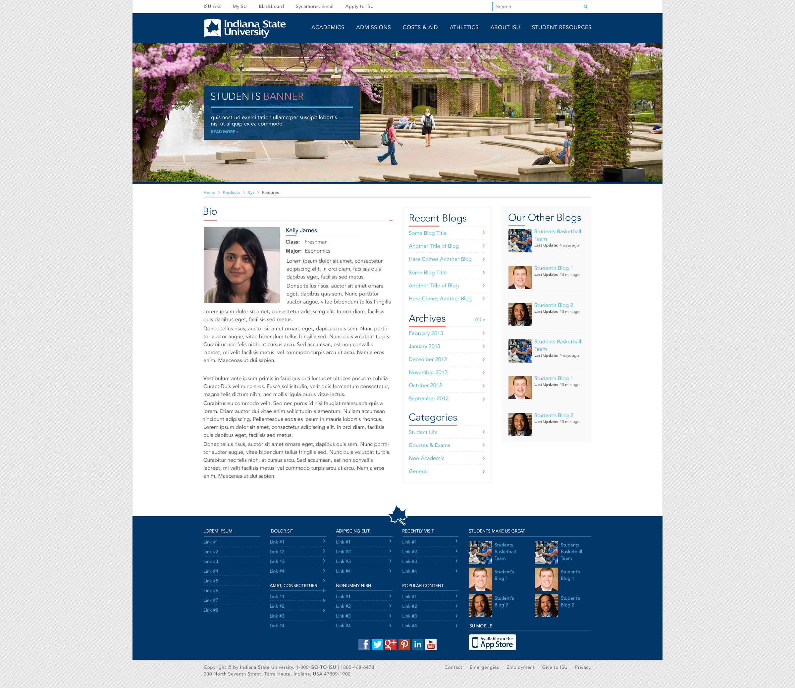
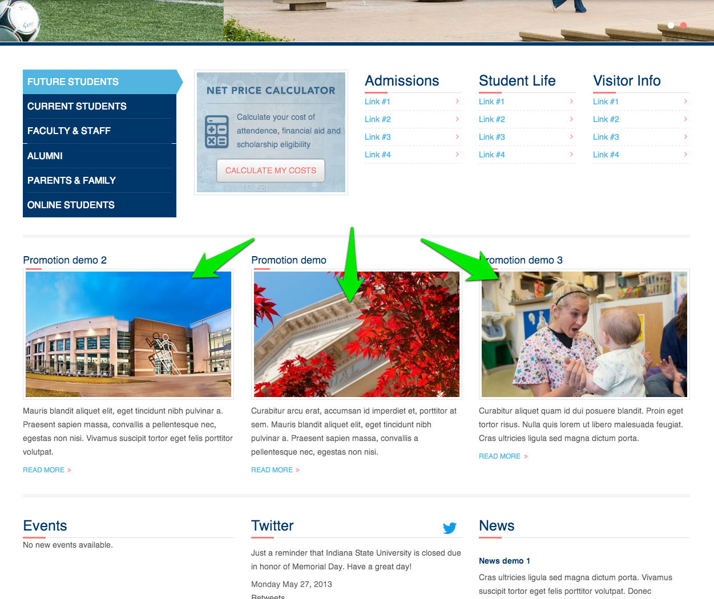
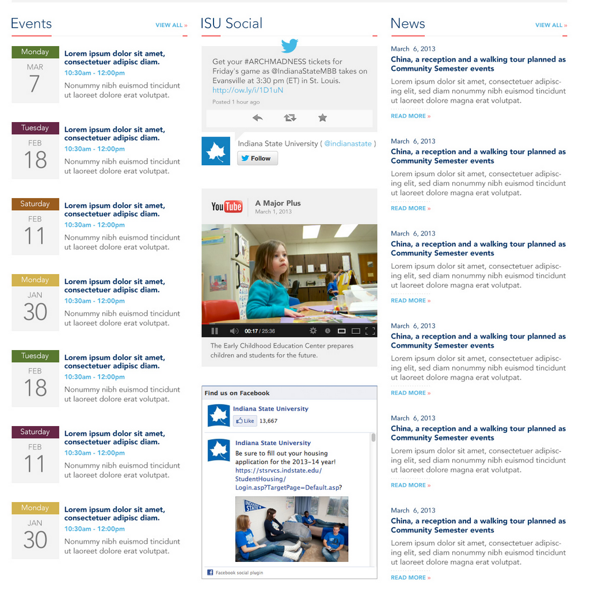
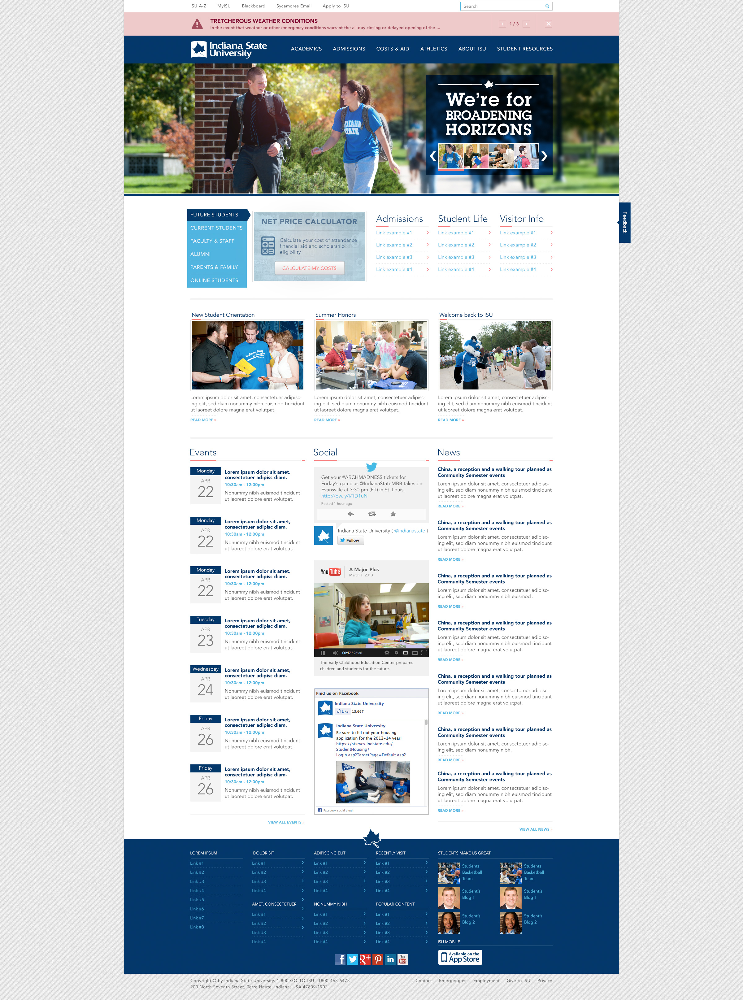

# Content types

The ISU main site contains a number of content types for different purposes.

- [Article](#article)
- [Basic page](#basic_page)
- [Department](#department)
- [Event](#event)
- [External Link](#external_link)
- [Gallery](#gallery)
- [News](#news)
- [Profile](#profile)
- [Program](#program)
- [Promotion](#promotion)
- [Slide](#slide)
- [Topic hub](#topic_hub)
- [User Alert](#user_alert)
- [Webform](#webform)

## Article

The Article content type is comes pre-installed with Drupal. For ISU it is deprecated and not used for any purpose. It will be removed.

## Basic page

The Basic page content type is the most generic type of content in the site. Its purpose is to be a catch-all for unstructured content that does not have a better location. Since most of the content ISU has is unstructured, this content type will be used heavily.

- Use basic page for your static content, such as an 'About us' page.
- Don't use basic page for content that has a specific, repeatable, structure and is modeled in another data structure in the site.

## Department

The Department content type is for housing summary information about departments at the university. The entries created with this content type are used to populate the Academics portion of the main site. The content is brochure-like in nature in that it is meant to highlight the department and attract users to click through to the actual department websites (which will be housed on the new college sites).

- Use department for listing and highlighting individual departments in the university.
- Don't use department to detail all information about a department and its offerings, or to try to house an actual department website.

## Event

The Event content type is for listing events. Its purpose is to capture upcoming events and categorize them in order to display them in various listings and visualizations on the site. This includes calendar displays and things like iCal feeds.

- Use event for listing events.
- Don't use event for listing news or other timely content that is not strictly an event.

## External link

The External link content type is used for manually adding links that should be indexed and listed in the A-Z listing page. The A-Z listing is automatically indexing and displaying most of the relevant internal site content, but does not automatically index external site content. Adding items to this content type allows the A-Z search and listing to display manually entered links.

- Use external link for populating the search and A-Z listing page with links to internal and external content that does not already appear in the A-Z, but you would like it to appear.
- Don't use external link for adding links to content that is already automatically populating the A-Z listing page.

## Gallery

The gallery content type was intended to be a collection of image file entities that can be tagged, titled, have a cover image upload field, and provide a short description. While the intent of this content type was to provide collections of images organized into galleries, during development it was re-prioritized and lost it's original purpose. This can either be recovered and repurposed to fit an ISU need, or it can be marked deprecated and removed.

*** This content type has not been used or tested since initial development, so it may require some additional tweaking to be useful.

## News

The News content type is for listing news. Its purpose is to capture recent news articles and categorize them in order to display them in various listings on the site and to syndicate them via RSS.

- Use news for listing news articles.
- Don't use news for listing events or for creating basic static pages in the site.

## Profile

The Profile content type is for highlighting individuals at the university and providing a landing page for the profile. The original design specification showed these profiles being displayed in an interactive slider interface. This was originally part of the blog content type and associated pages that were pushed to a later phase of development.

*** This content type has not been used or tested since initial development, so it may require some additional tweaking to be useful.

## Program

The Program content type is for listing programs offered by the university, like majors, minors, licentures, PhDs, etc. This content is then used to highlight programs in the Academics section of the main site. The content created here is brochure in nature, it is meant to attract users to click through to the actual program home pages, which will be housed on the college sites that offer the program.

- Do use program for listing and highlighting information about programs.
- Don't use program to detail all information about a program and its offerings, or to try to house an actual program website.

## Promotion

The Promotion content type is for highlighting particular content on landing pages. For instance, the original design specification has a promotion bar on the homepage that was meant to list three promotions. These promotions are somewhat generic content that can be used for landing page purposes.

- Do use promotion for calling out small blocks of content to be emphasized on landing pages.
- Don't use promotion for structuring other types of content.

*** This content type has not been used or tested since initial development, so it may require some additional tweaking to be useful.

## Slide

The Slide content type is for creating banner images with overlay messages for the header banner. These slides are then placed in nodequeues which are rendered as blocks and placed in the banner region of the site header.

- Use slide for creating banner images and overlays.
- Don't use slide for anything else.

## Topic hub

The Topic hub content type is for creating dashboard content pages that pull in content from across the site based on a particular tag or set of tags. This content type utilizes tag meta-data to render landing pages that highlight news, events, social media, and potentially other content.

*** This content type has not been used or tested since initial development, so it may require some additional tweaking to be useful.

## User alert

A User alert is a short message displayed at the top of the site, alerting users to critical information like an emergency or breaking news. After viewing it, they can click and close the message. User alerts can happen as a top-of-the-site interruption message or as a modal overlay, which can be selected in the admin creation form.

- Use user alert for alerting users to emergencies.
- Don't use user alert for trivial alerts that don't require full-site interruption.

## Webform

A webform is a form or questionnaire accessible to users. Submission results and statistics are recorded and accessible to privileged users.

- Use webform for creating forms to solicit information from users.
- Don't use webform for creating non-form content.

