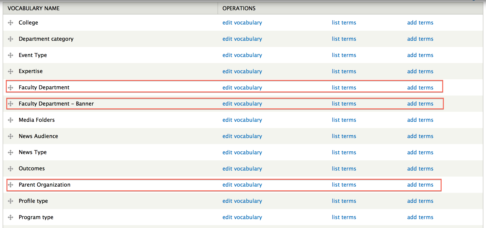
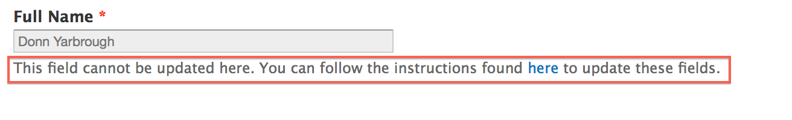
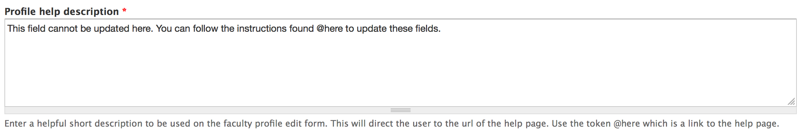
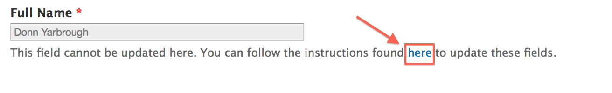

# Faculty/Staff Profiles - Administration

* [Updating Faculty Departments](#updating-faculty-departments)
* [Updating your Profile Image](#updating-your-profile-image)
* [Banner Import File](#banner-import-file)
* [Image API URL](#image-api-url)
* [Profile Help Description](#profile-help-description)
* [Profile Help URL](#profile-help-url)

## Updating Faculty Departments

There are three faculty taxonomies that affect faculty/staff profiles. 

A link to each taxonomy can be found by navigating to [http://cms.indstate.edu/admin/structure/taxonomy](http://cms.indstate.edu/admin/structure/taxonomy)

Below are descriptions of each taxonomy and their intended purpose:

* **Faculty Department - Banner**
	* Notice the word **Banner** in the taxonomy name. This is because these terms are the departments that come directly from **Banner**.
	* Terms in this taxonomy are automatically created during the faculty/staff import. This is the term that is associated with each faculty/staff profile. It is hidden from view and cannot be updated because this information comes directly from the Banner import file.
	* Inside this taxonomy are two additional fields which define a relationship to the taxonomies **Faculty Department** and **Parent Organization**.
* **Faculty Department**
	* This is the **English** version of the **Banner** department. On the **Faculty Department - Banner** term, you can select the **Faculty Department** that the Banner department should relate to. 
	* This is the department that is displayed on Faculty/Staff profiles.
	* This is a parent term of the **Faculty Department - Banner** which allows multiple Banner departments to share the same parent department. An example of this would be the **Networks Financial Institute**. It is a single department, but there are multiple Banner departments that make up this department. For example, NETWORKS, Networks-Research and Networks-Student Scholarships make up this department.
* **Parent Organization**
	* This is the **Parent Organization** of the **Faculty Department - Banner** department. On the **Faculty Department - Banner** term, you can select the **Parent Organization** that the Banner department should relate to.  
	* This is also a parent term of the **Faculty Department - Banner** which serves to group Banner departments into colleges/organizations. This relationship was created to allow external sites, such as college sites, to query faculty/staff based on their college.

### Updating Scenarios
1. You want to update the name of an **English** version of a Banner department/You want to update the name of a **Faculty Department**
	* Navigate to [http://cms.indstate.edu/admin/structure/taxonomy/faculty_department](http://cms.indstate.edu/admin/structure/taxonomy/faculty_department)
	* Locate the department you want to update
	* Click **edit** to open the edit form
	* Change the **Name** of the department 
	* Click **Save**
2. You want to change the **Faculty Department** a Banner Department is associated with.
	* Navigate to [http://cms.indstate.edu/admin/structure/taxonomy/faculty_department_banner](http://cms.indstate.edu/admin/structure/taxonomy/faculty_department_banner)
	* Locate the Banner department you want to update
	* Click **edit** to open the edit form
	* In the **Department** drop down, update the **Department** associated with this Banner department.
3. You want to update the college associated with a Banner department.
	* Navigate to [http://cms.indstate.edu/admin/structure/taxonomy/faculty_department_banner](http://cms.indstate.edu/admin/structure/taxonomy/faculty_department_banner)
	* Locate the Banner department you want to update
	* Click **edit** to open the edit form
	* In the **Parent Organization** drop down, update the **Parent Organization** to the college associated with this Banner department.
	
## Updating your Profile Image

If you have an adequate role, you can use an alternate image for your Faculty/Staff profile. 

On the [Update Faculty Profile](http://cms.indstate.edu/admin/faculty-edit) page, scroll down below the normal Banner Image and you should have an option to add or update the **Override Banner Image** field.

## Banner Import File

The Banner Import file holds data that will import nightly and create/update faculty/staff profiles. It is important that the website knows the name of this file so that imports will not be interrupted.

If the name of the file has changed, you will need to update it in the **Faculty Settings** which can be found by nagivating to the [Faculty Settings Page](http://cms.indstate.edu/admin/config/people/isu_faculty)

## Image API URL

The Image API URL holds the web address that returns faculty/staff images for their respective profile. 

If the web address changes, you will need to update it in the **Faculty Settings** which can be found by navigating to the [Faculty Settings Page](http://cms.indstate.edu/admin/config/people/isu_faculty)

## Profile Help Description

You can update the message above by navigating to the [Faculty Settings Page](http://cms.indstate.edu/admin/config/people/isu_faculty)
and updating the **Profile help description** 

Use the **@here** placeholder as a link to the **Basic page** that will hold instructions on how the faculty/staff can update their Banner information.

## Profile Help URL


This is the link to the **Basic page** that holds instruction on how the faculty/staff can update their Banner information.

