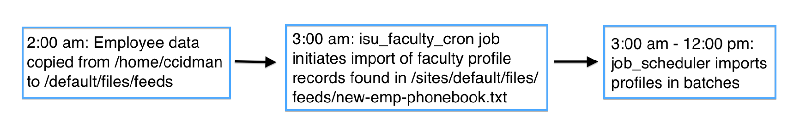
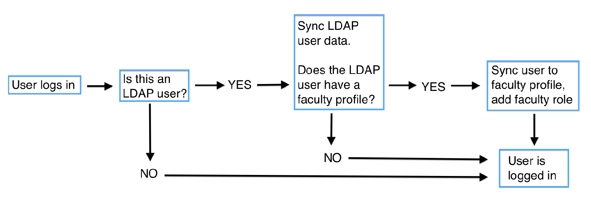

<a href="index.html">Home</a>

# Faculty Profiles - Technical Document

* [Import Process](#import-process)
* [Fields](#fields)
* [Faculty Images](#faculty-images)
* [Syncing User to Profile](#syncing-user-to-profile)
* [Search Index](#search-index)
* [SSO Login](#sso-login)
* [LDAP SSO Decision](#ldap-sso-decision)
* [Troubleshooting](#troubleshooting)

## Import Process

Every night, ISU exports faculty data to the following location on the web server `/home/ccidman`

At **2:00 am**, a Jenkins job copies all files located in the `/home/ccidman` directory to the `/sites/default/files/feeds` directory. At **3:00 am**, elysia_cron kicks off the isu_faculty_cron job which triggers the Feeds importer 'staff_profiles'. Faculty profiles are then updated in batches based on the job_scheduler cron job.

## Fields

The faculty profile fields that are updated during isu_faculty_cron are followed below. Fields that have custom modifications have explainations provided.

* **title**: the field_first_name and field_last_name create the title
* **field_name_prefix**: PZVDIRE_NAME_PREFIX
* **field_first_name**: PZVDIRE_NAME_FIRST
* **field_middle_name**: PZVDIRE_NAME_MIDDLE
* **field_last_name**: PZVDIRE_NAME_LAST
* **field_name_suffix**: PZVDIRE_NAME_SUFFIX
* **field_job_title**: PZVDIRE_JOB_DESC
* **field_id**: PZVDIRE_ID
* **field_pidm**: PZVDIRE_PIDM
* **field_email**: PZVDIRE_OFFICE_EMAIL
* **field_office**: PZVDIRE_OFFICE_STREET_LINE1
* **field_telephone**:
	* PZVDIRE_OFFICE_PHONE
	* the output of this field has hard-coded area code and three digit prefix if needed.
* **field_banner_image**: This field is populated by using ISU's image API which is currently in a development state and may be updated. An updatable setting has been added to allow site admins to update the url of the image API in the event that ISU updates their endpoint url. See [here](#faculty-images) for more information.
* **field_faculty_department_banner**:
	* PZVDIRE_JOB_DEPT
	* This taxonomy term_reference has two fields which are used to group data for external use: field_parent_organization and field_faculty_department. These fields are not saved on the faculty content, they are saved in the taxonomy term object.

## Faculty Images

### How images are imported
During the faculty profile import, the image file associated with it is downloaded from the ISU image API by accessing the following url:

`https://jas.indstate.edu/DisplayBlobServlet/?pidm=[id]`.

The file is saved to the database using a custom function **_file_save_external()**. Because the image format is originally saved in a TIFF format, it is converted to PNG by using the PHP extension ImageMagick. This is also done in the _file_save_external() function.

## Syncing User to Profile

When a user logs in, the LDAP module attempts to sync the Drupal user to an LDAP user. Syncing is performed in the isu_faculty_ldap_user_edit_user_alter() function. This function checks the LDAP user attribute **employeenumber** and attempts to find a faculty profile with field_id that matches. If found, the LDAP sync is successful and the user is given the 'faculty' role and assigned owner of their respective faculty profile node.

## Search Index

Faculty searching on [http://cms.indstate.edu/search/faculty-staff](http://cms.indstate.edu/search/faculty-staff) is based on the view **isu_faculty** which is a search_api index view. This means that unless faculty is indexed, no results will appear here.

The faculty index settings can be found at [http://cms.indstate.edu/admin/config/search/search_api/index/faculty](http://cms.indstate.edu/admin/config/search/search_api/index/faculty)

It is important to know that the order of the index processors can affect whether the items get properly indexed. The order which works is:
* Ignore case
* Tokenizer
* Fuzzy Search search settings
* Fuzzy Search excerpt settings

## SSO Login

Single Sign On is only accessible through [http://cms.indstate.edu/user/login/sso](http://cms.indstate.edu/user/login/sso).

A custom module was needed in order for the ldap_sso module to  work with ISU's server settings. The ldap_sso module is expecting a `$_SERVER['REMOTE_USER']` variable which was not produced by ISU's web server. The name of that value was instead, `$_SERVER['PHP_AUTH_USER']` which the ldap_sso module didn't know to look for. The custom module, ldap_sso_authnz was created to set the `$_SERVER['REMOTE_USER']` variable. After setting that variable, the normal ldap_sso_user_login_sso() function is called.

In addition to the custom module, httpd settings were updated to allow for a connection between the web server and the LDAP server. Those settings can be found on the web server in the following locations:

**Production**

`/etc/httpd/vhost.d/vhost-cms.indstate.edu `

**Staging**

`/etc/httpd/vhost.d/vhost-wwwtest.indstate.edu `

The settings required for SSO to succeed is:

`<Location /user/login/sso>
    AuthType basic
    AuthBasicProvider ldap
    AuthName "ISU - Login using your ISU user name and password"
    AuthLDAPURL "ldaps://isuad.indstate.edu/OU=ISU Users,DC=isuad,DC=indstate,DC=edu?cn" SSL
    AuthLDAPBindDN "CN=svcWWWDrupal,OU=Service Accounts,OU=OIT,DC=isuad,DC=indstate,DC=edu"
    AuthLDAPBindPassword CMSAuthentication4ISU!
    AuthzLDAPAuthoritative off
    AuthLDAPRemoteUserAttribute cn
    Require valid-user
  </Location>`

## LDAP SSL Decision

It was important to have a secure connection during the SSO process and for the most part, all connections are made securely.

Here is an excerpt from an email explaining the current SSL situation in regards to LDAP/SSO:

**START OF EMAIL**

The good news is that SSL protocol is initiated during LDAP authentication between the client (ISU user) and server. So it's safe to say that user credentials are safely encrypted during that phase of SSO login. Both the web and LDAP connection protocols are using SSL to encrypt the username/password during the exchange.

However, we were not able to consistently lookup LDAP user data through SSL with the service account. This is not ideal, but there are lower risks in this connection as the only data passing is basic LDAP user attributes and the credentials for the service account.  The service account should not have any write permissions and is only used to look up LDAP data. In addition, this connection is not client side meaning the exchange happens between the web server and the LDAP server which are both behind ISU's firewall/VPN.

The temporary solution as agreed by all of us this morning, was to continue using non-SSL to lookup LDAP user attributes (to verify their account name and email) so that the LDAP user can consistently log in to their Drupal account via SSO. We also agreed to continue investigating a resolution to the issue going forward.

**END OF EMAIL**

The location of the settings where non-SSL configuration is set can be found here:

[http://cms.indstate.edu/admin/config/people/ldap/servers/edit/isu](http://cms.indstate.edu/admin/config/people/ldap/servers/edit/isu)

## Troubleshooting
Here are a list of potential problems that may arise in the future.

* **Faculty profiles aren't updating/importing**
	* Verify that ISU is still updating the files in /home/ccidman
	* Verify that the Jenkins job is updating /default/files/feeds
	* Verify that the file name is correct on /admin/config/people/isu_faculty
* **SSO is not working**
	* Check the dblog for ldap errors
	* If error log doesn't reveal obvious answer, test LDAP connection by going to [http://cms.indstate.edu/admin/config/people/ldap/servers/test/isu](http://cms.indstate.edu/admin/config/people/ldap/servers/test/isu) and clicking **Test**
	* If the test returns LDAP data, you know that an LDAP connection is being made. If not, there is a problem connecting to the LDAP server.
* **Faculty images are not updating**
	* Connect to the ISU VPN and manually type in the url (found [here](http://cms.indstate.edu/admin/config/people/isu_faculty)) with a real PIDM number.
	* If no image is loaded from the url, you will know to contact ISU to get further information
* **Faculty profiles aren't appearing in search results**
	* Make sure the nodes are being indexed by navigating to [http://cms.indstate.edu/admin/config/search/search_api/index/faculty](http://cms.indstate.edu/admin/config/search/search_api/index/faculty) and ensuring the processor settings are correct. Information about that can be found [here](#search-index).

  
Created on March 06, 2014 
  Last modified on March 06, 2014 
  Authored by Gray Sadler

