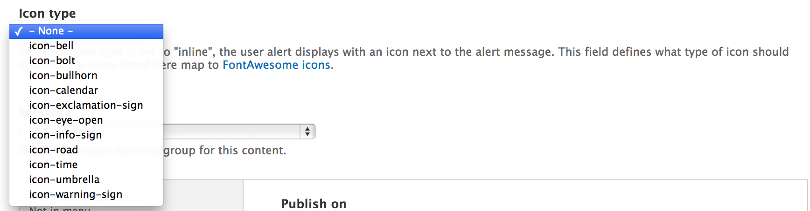

# User Alerts

1. [What they are](#what-they-are)
2. [How they work](#how-they-work)
3. [Types](#types)
4. [Icons](#icons)
5. [Scheduling](#scheduling)
6. [View existing alerts](#view-existing-alerts)

## What they are

User Alerts are temporary site notifications that are placed in the site in order to alert users to some pertinent and timely information. They are ordinarily placed in the site to either notify users of some sort of emergency/critical information or notify users of something that may be helpful for them to know while using the site.

The User Alerts ordinarily display for a period of a couple of hours to a couple of weeks depending on the situation. Here are some valid use cases:

- The university is closed for the holidays.
- There is emergency weather or other safety situation that you'd like everyone to be aware of.
- There is a university-wide initiative of some sort all visitors need to be alerted to.
- The website is soliciting user feedback and would like to ask everyone to visit a link to fill out a form.
- The website design has changed and visitors should be instructed about the changes.

## How they work

User Alerts have their own content type named "User Alert". All published user alert nodes will display to all users with the appropriate permissions to view user alerts. This means that the process of displaying and hiding user alerts is a matter of publishing and unpublishing nodes. The site may have un-limited number of user alerts published and unpublished at any time. This may be helpful in particular to be able to save generic or recurring alerts in the site so that they can be used again at a later date, or simply reviewed in the process of creating a new alert.

Creating a new user alert is as simple as creating a User Alert node:

[/node/add/user-alert](http://cms.indstate.edu/node/add/user-alert)

The user alert content is comprised of a title and body field, and the form has a number of additional configuration fields.

## Types

There are two different types of user alerts. To select the type of user alert there is a "View type" field that defines the user alert type.

### 1. Inline

The inline user alert displays at the top of the page between the utility bar and the site header. It interrupts the design flow of the site and draws the user's attention with a stark contrast. The inline alert cannot be closed by the user and all users will see it on all pages as long as it is published.

### 2. Lightbox Modal Overlay

The lightbox modal overlay user alert displays as a popup overlay in the middle of the screen. It interrupts the view of the site and forces the user to interact with it. It contains a close button and responds to the user clicking outside the window in order to also close it. Once it's closed, an entry will be saved as a cookie in the user's browser and that user will no longer see that alert message. As a result, lightbox modal overlay alerts should be used for less invasive and more temporary purposes.

## Icons

The inline user alert type features an icon next to the user alert to help draw the eye and visually communicate the nature of the alert. There is an "Icon type" field in the content type and selecting an icon there corresponds with the type of icon that will display in the alert.

The icons come from a library called FontAwesome and the names of the icons in the field correspond with the names of the icons in that library:

[FontAwesome Icons](http://fontawesome.io/3.2.1/icons/)

## Scheduling

Since user alerts are nodes they can use the core node scheduling configuration to schedule user alerts to be published/unpublished at a specific times. When a user alert is scheduled, the site will publish/unpublish the alert the next time cron is run after the scheduled time. As a result, cron needs to be setup to run more or less frequently in order to achieve your desired accuracy to the scheduled time.

In order to schedule an alert go to the "Scheduling options" tab at the bottom of the user alert node form and enter the date and time you'd like the alert to be published or unpublished on in the corresponding fields.

## View existing alerts

To view existing user alerts, for instance in the event that you need to remove one that's currently published or find an old alert that you'd like to republish or copy from, visit the content administrative page and filter the results so that the "type" equals "User Alert":

[/admin/content](http://cms.indstate.edu/admin/content)

Created on January 3, 2014 
Last modified on January 3, 2014 
Authored by Kevin Champion

