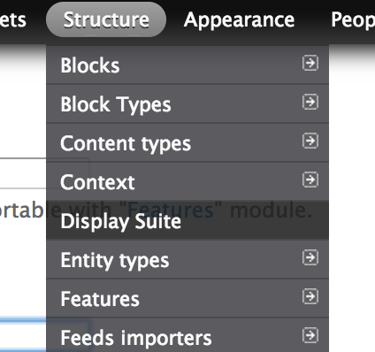
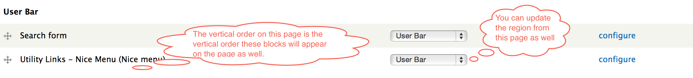
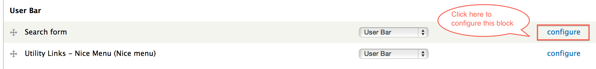
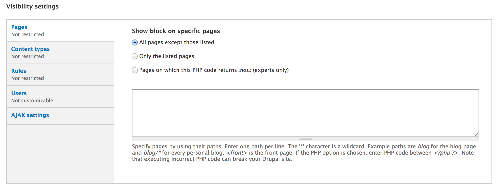
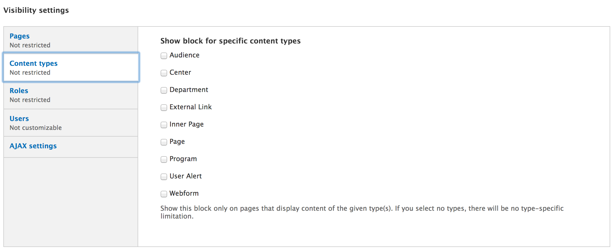
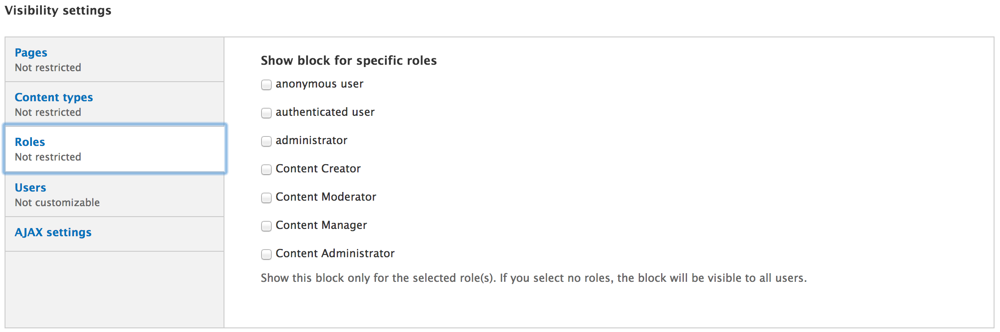
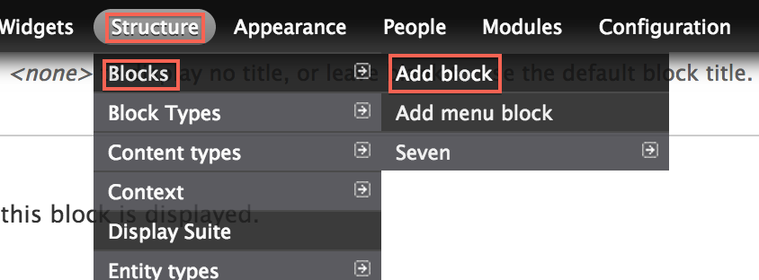

# Blocks

* [What are blocks?](#what-are-blocks)
* [Administering blocks](#administering-blocks)
	* [Visibility settings](#visibility-settings)
* [Adding a block](#adding-a-block)

## What are blocks?

Blocks are the boxes of content (such as "User Login" or "Search form") that can be displayed in sections (such as header or footer) on your page.

## Administering blocks

### Navigate to the block administration page

	Structure > Blocks

The block administration page also lets you specify the vertical sort-order of the blocks. 

### Choose a block to configure

Find the block you want to configure, and click **configure** under the **OPERATIONS** column.

Configuring blocks allows you customize it's visibility and location (region) it is in.

### Visiblity Settings

#### Pages

Individual blocks can be configured to only show/hide on certain pages. This can be a path like "about" for the about page, "about/*" where the asterisk is any path that starts with "about". An important exception is the frontpage: "<front>". 

#### Content types

Individual blocks can be configured to only show/hide for certain content types. 

Select which content types this block should appear on.

#### Roles

Individual blocks can be confifured to only show/hide for certain user roles.

Select which user roles this block should appear for.

## Adding a block

### Navigate to the add block page

	Structure > Blocks > Add block

	
### Configure your new block

The only required fields of this new block is the **Block description** and **Block body**.

The **Block description** is only used to help identify the block from the block administration page.

the **Block body** uses a formatting toolbar similar to other textareas you will find in other forms on the site. 

Finally, configure the [visibility settings](#visibility-settings) of the new block.

Created on January 10, 2014 
Last modified on January 13, 2014 
Authored by Gray Sadler
