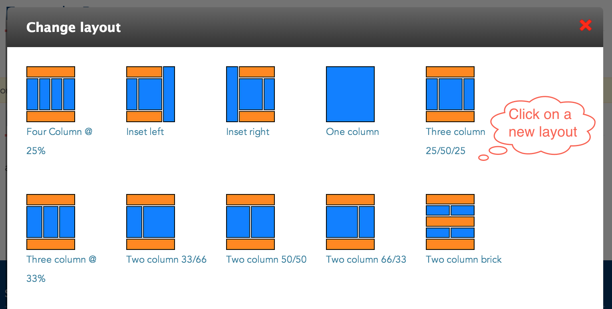

# Audiences

* [What are audiences?](#what-are-audiences)
* [Creating audiences](#creating-audiences)
* [Updating audiences](#updating-audiences)
* [Deleting audiences](#deleting-audiences)
* [Changing audience layouts](#changing-audience-layouts)
* [Adding widgets to audiences](#adding-widgets-to-audiences)

## What are audiences?

audiences are a **content type** that represent the audiences inside your college. 

Each audience created populates the Audience menu.

## Creating audiences

### 1. Open the 'Create audience' form
In the Administration Menu, navigate to:
	
	My Workbench > Create content > Audience
		

### 2. Choose an Audience Name
Enter the name of the **Audience**.

### 3. Add copy
Enter the **Message** of this audience. This is the main copy of your page. 

Using the editor toolbar, you can add images or format your copy.

### 4. Add Resources

Resources are links to external (or internal) pages that you may find helpful for students.

### 5. Menu settings

Choose a **Menu link title** which will be the name of the menu item displayed.

More detail on the remaining items in this section can be found in the [Menu settings]() documentation.

## Updating audiences

### 1. Create a new draft

While viewing the audience, click the **New draft** tab located at the top of the page.

### 2. Make changes

Updating a audience is very similar to [Creating a audience](#creating-audiences). Make the changes you want and then click the **Save** button located at the bottom of the form.

## Deleting audiences

### 1. Open a new draft

While viewing the audience, click the **New draft** tab located at the top of the page.

### 2. Delete the audience

At the bottom of the **New draft** form, click **Delete**.

### 3. Confirm deletion

Confirm the deletion by clicking the **Delete** button.

## Changing audience layouts

### 1. Change the layout

On the audience you want to change the layout for, click the **Change this layout** button located at the bottom of the page.

### 2. Choose a layout

Select the layout you would like for this audience.

### 3. Approve content locations

Move content around and once you are satisfied, click **Save**. 

## Adding widgets to audiences

### 1. Customize the page

On the audience you want to customize, click the **Customize this page** button located at the bottom of the page.

### 2. Update the content

Make the changes that you want. 

For a more detailed tutorial, please read [Customizing Pages]()

### 3. Save your changes

Once you are satisfied with the changes, click **Save**. 

