# Centers

* [What are centers?](#what-are-centers)
* [Creating centers](#creating-centers)
* [Updating centers](#updating-centers)
* [Deleting centers](#deleting-centers)
* [Changing center layouts](#changing-center-layouts)
* [Adding widgets to centers](#adding-widgets-to-centers)

## What are centers?

centers are a **content type** that represent the centers inside your college. 

## Creating centers

### 1. Open the 'Create center' form
In the Administration Menu, navigate to:
	
	My Workbench > Create content > Center
		
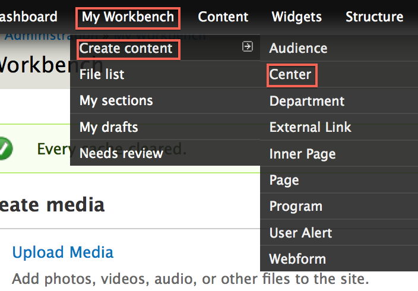

### 2. Add a banner
Add a new or existing [Banner Slide](banner_slides.md).

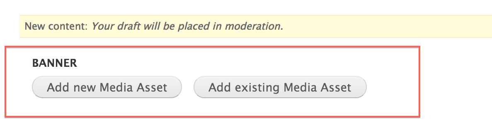

### 3. Choose a center Name
Enter the **Center Name** for this center.

### 4. Choose a Shortened Center Name
Enter the **Shortened Center Name** for this center.

This short name will be used in the center's url and other areas around the site. 

An **example** of a shortened name for the <i>center of Biology</i> would be <i>Biology</i>

### 5. Add copy
Enter the **Description** of this page. This is the main copy of your page. 

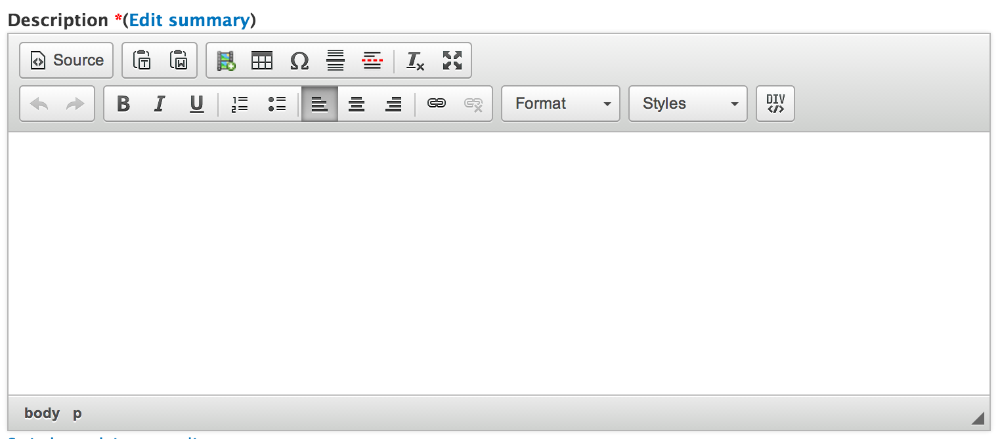

Using the editor toolbar, you can add images or format your copy.

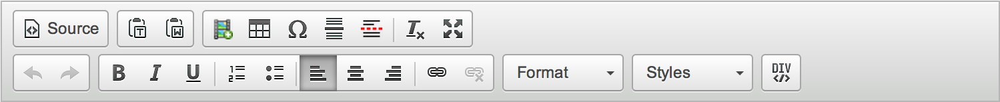

### 6. Add Office Info

In this section you can add information for:

* Office Hours
* Address
* Email
* Phone
* Fax

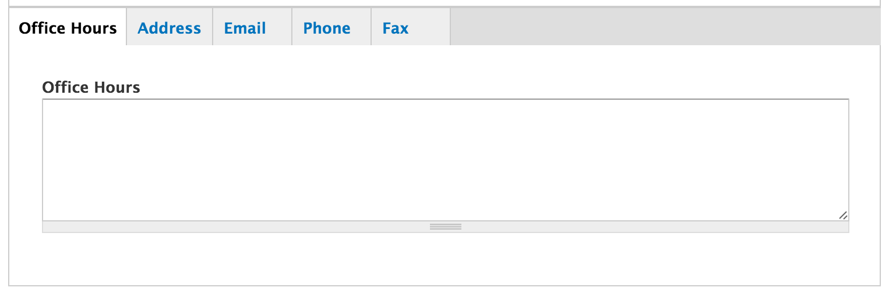

### 7. Menu settings

Choose a **Menu link title** which will be the name of the menu item displayed.

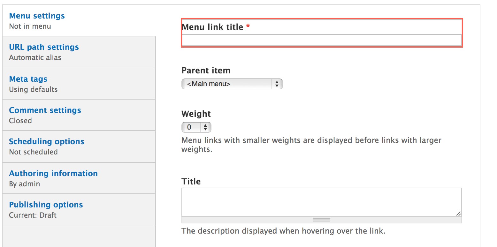

More detail on the remaining items in this section can be found in the [Menu settings]() documentation.

## Updating centers

### 1. Create a new draft

While viewing the center, click the **New draft** tab located at the top of the page.

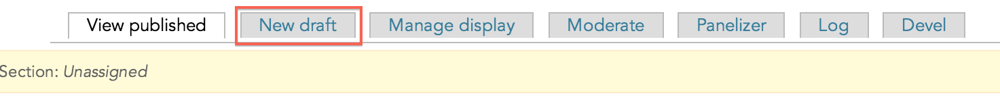

### 2. Make changes

Updating a center is very similar to [Creating a center](#creating-centers). Make the changes you want and then click the **Save** button located at the bottom of the form.

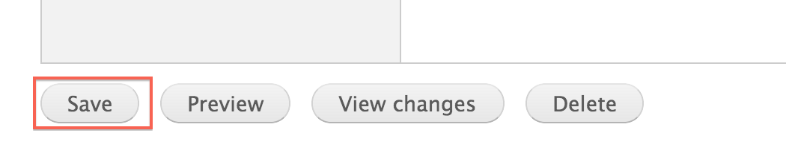

## Deleting centers

### 1. Open a new draft

While viewing the center, click the **New draft** tab located at the top of the page.

### 2. Delete the center

At the bottom of the **New draft** form, click **Delete**.

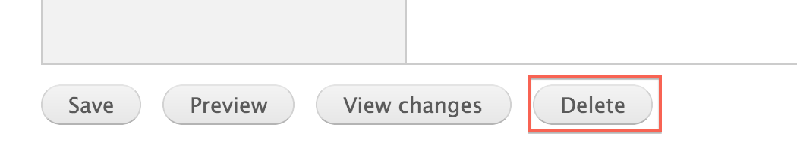

### 3. Confirm deletion

Confirm the deletion by clicking the **Delete** button.

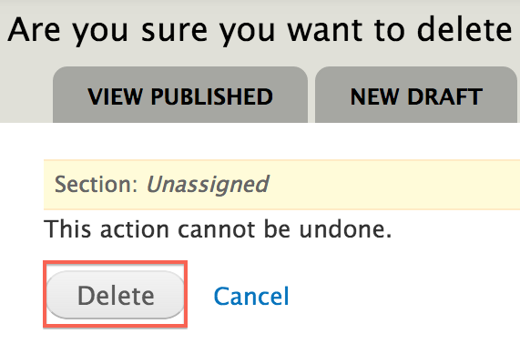

## Changing center layouts

### 1. Change the layout

On the center you want to change the layout for, click the **Change this layout** button located at the bottom of the page.

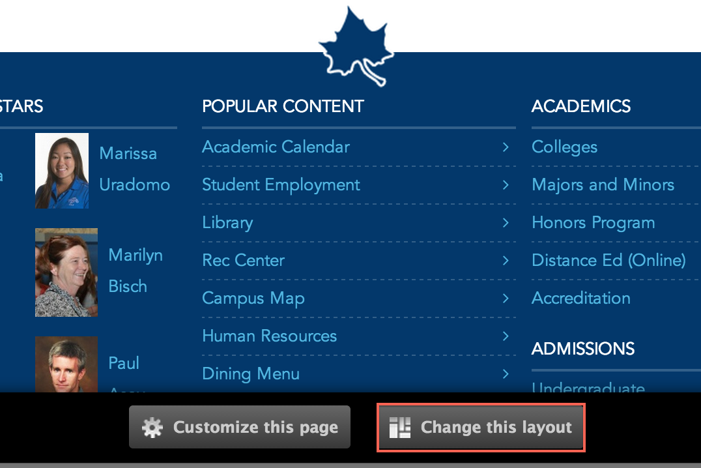

### 2. Choose a layout

Select the layout you would like for this center.

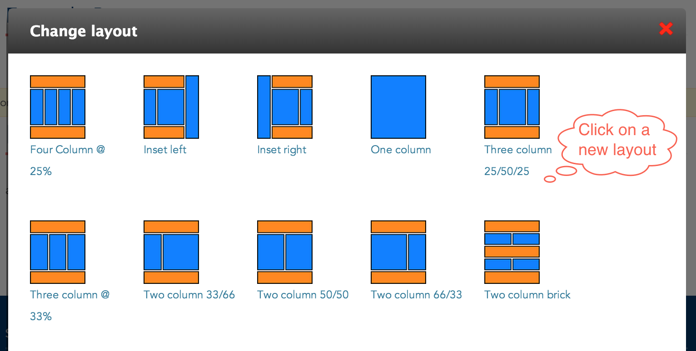

### 3. Approve content locations

Move content around and once you are satisfied, click **Save**. 

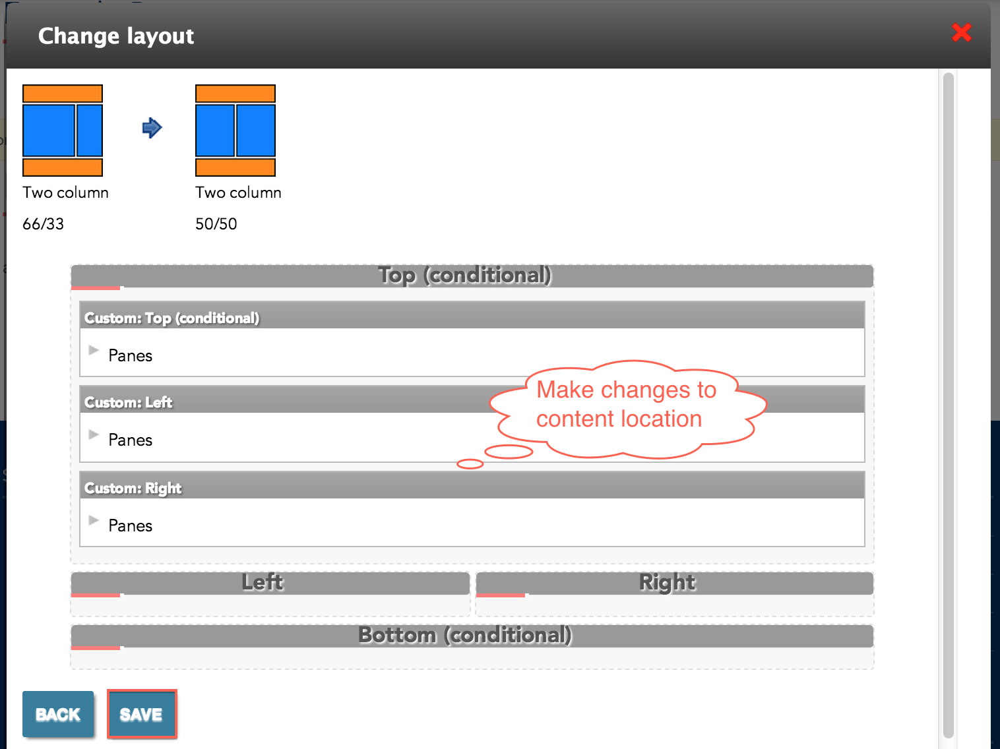

## Adding widgets to centers

### 1. Customize the page

On the center you want to customize, click the **Customize this page** button located at the bottom of the page.

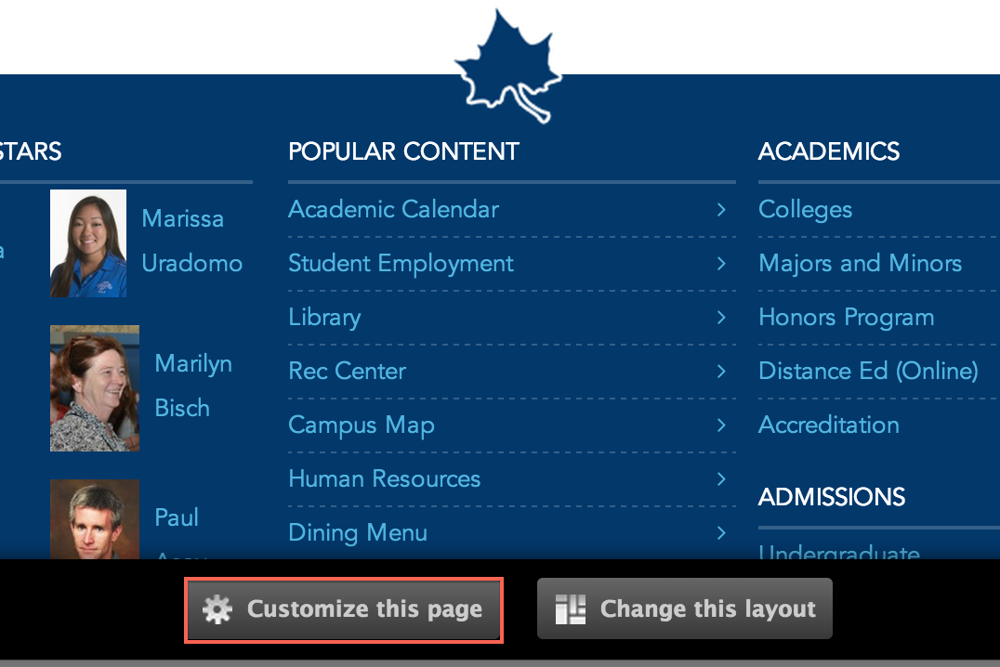

### 2. Update the content

Make the changes that you want. 

For a more detailed tutorial, please read [Customizing Pages]()

### 3. Save your changes

Once you are satisfied with the changes, click **Save**. 

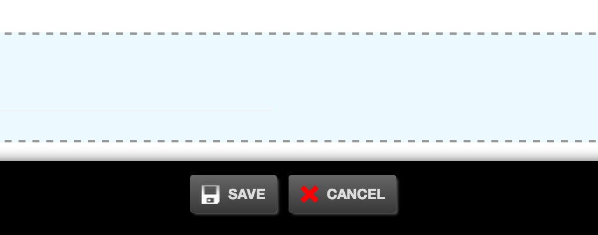
