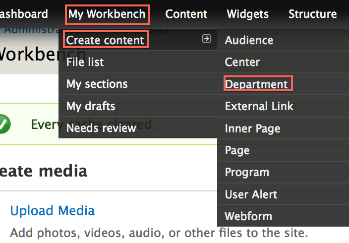

# Departments

* [What are departments?](#what-are-departments)
* [Creating departments](#creating-departments)
* [Updating departments](#updating-departments)
* [Deleting departments](#deleting-departments)
* [Changing department layouts](#changing-department-layouts)
* [Adding widgets to departments](#adding-widgets-to-departments)

## What are departments?

Departments are a **content type** that represent the departments inside your college. 

## Creating departments

### 1. Open the 'Create Department' form
In the Administration Menu, navigate to:
	
	Content > Add content > Department
		

### 2. Add a banner
Add a new or existing [Banner Slide](banner_slides.md).

### 3. Choose a Department Name
Enter the **Department Name** for this Department.

### 4. Choose a Shortened Department Name
Enter the **Shortened Department Name** for this Department.

This short name will be used in the department's url and other areas around the site. 

An **example** of a shortened name for the <i>Department of Biology</i> would be <i>Biology</i>

### 5. Add copy
Enter the **Description** of this page. This is the main copy of your page. 

Using the editor toolbar, you can add images or format your copy.

### 6. Add Office Info

In this section you can add information for:

* Office Hours
* Address
* Email
* Phone
* Fax

### 7. Menu settings

Choose a **Menu link title** which will be the name of the menu item displayed.

More detail on the remaining items in this section can be found in the [Menu settings]() documentation.

## Updating departments

### 1. Create a new draft

While viewing the department, click the **New draft** tab located at the top of the page.

### 2. Make changes

Updating a department is very similar to [Creating a department](#creating-departments). Make the changes you want and then click the **Save** button located at the bottom of the form.

## Deleting departments

### 1. Open a new draft

While viewing the department, click the **New draft** tab located at the top of the page.

### 2. Delete the department

At the bottom of the **New draft** form, click **Delete**.

### 3. Confirm deletion

Confirm the deletion by clicking the **Delete** button.

## Changing department layouts

### 1. Change the layout

On the department you want to change the layout for, click the **Change this layout** button located at the bottom of the page.

### 2. Choose a layout

Select the layout you would like for this department.

### 3. Approve content locations

Move content around and once you are satisfied, click **Save**. 

## Adding widgets to departments

### 1. Customize the page

On the department you want to customize, click the **Customize this page** button located at the bottom of the page.

### 2. Update the content

Make the changes that you want. 

For a more detailed tutorial, please read [Customizing Pages]()

### 3. Save your changes

Once you are satisfied with the changes, click **Save**. 

