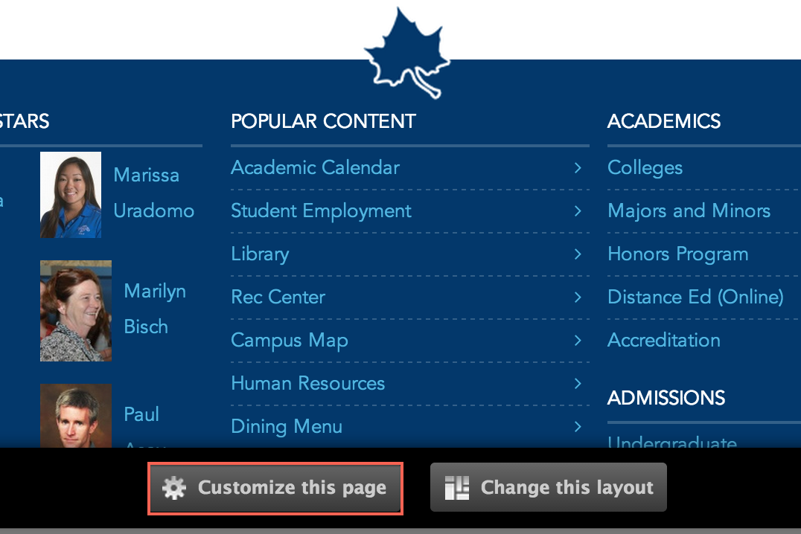

# Inner pages

* [What are inner pages?](#what-are-inner pages)
* [Creating inner pages](#creating-inner pages)
* [Updating inner pages](#updating-inner pages)
* [Deleting inner pages](#deleting-inner pages)
* [Changing inner page layouts](#changing-inner page-layouts)
* [Adding widgets to inner pages](#adding-widgets-to-inner pages)

## What are inner pages?

Inner pages are a **content type** similar to a page, but are considered child pages and therefore inherit properties of the content you are creating an inner page of.

For example, if you were to create an **inner page** for a Department, the **inner page** would inherit the top banner and Department Menu of that Department. 

## Creating inner pages

### 1. Open the 'Create inner page' form
In the Administration Menu, navigate to:
	
	My Workbench > Create content > Inner page
		

### 2. Select a banner
A banner can be inherited since this will be an Inner Page, so you can choose to inherit the banner or add a new or existing [Banner Slide](banner_slides.md)

For a more detailed tutorial on banners, see the [Banner Slide](banner_slides.md) tutorial.

By default the banner is inherited. Should you not want to inherit the [Banner](banner_slides.md), you may add a new or existing banner. First, click on the **Inherit Banner** section and uncheck the **Inherit Banner** checkbox.

Click on the **Banner** section and proceed to add a new or existing banner.

### 3. Choose a title
Enter the **Title** for this inner page.

### 4. Add copy
Enter the **Body** of this department. This is the main copy of your inner page. 

Using the editor toolbar, you can add images or format your copy.

### 5. Add an image

Select an **Image** for this inner page.

### 6. Menu settings

Choose a **Menu link title** which will be the name of the menu item displayed.

The **Parent item** is the location where this inner page will be found in the menu. The **Parent item** must be content such as a Department, Page, Program or Center. 

More detail on the remaining items in this section can be found in the [Menu settings]() documentation.

## Updating inner pages

### 1. Create a new draft

While viewing a inner page, click the **New draft** tab located at the top of the inner page.

### 2. Make changes

Updating a inner page is very similar to [Creating a inner page](#creating-inner pages). Make the changes you want and then click the **Save** button located at the bottom of the inner page.

## Deleting inner pages

### 1. Open a new draft

While viewing a inner page, click the **New draft** tab located at the top of the inner page.

### 2. Delete the inner page

At the bottom of the **New draft** form, click **Delete**.

### 3. Confirm deletion

Confirm the deletion by clicking the **Delete** button.

## Changing inner page layouts

### 1. Change the layout

On the inner page you want to change the layout for, click the **Change this layout** button located at the bottom of the inner page.

### 2. Choose a layout

Select the layout you would like for this inner page.

### 3. Approve content locations

Move content around and once you are satisfied, click **Save**. 

## Adding widgets to inner pages

### 1. Customize the inner page

On the inner page you want to customize, click the **Customize this inner page** button located at the bottom of the inner page.

### 2. Update the content

Make the changes that you want. 

For a more detailed tutorial, please read [Customizing inner pages]()

### 3. Save your changes

Once you are satisfied with the changes, click **Save**. 

