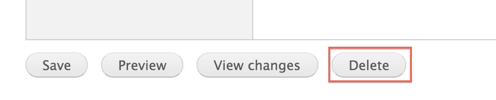
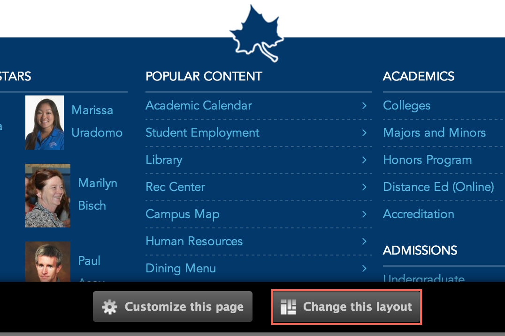

# Pages

* [What are pages?](#what-are-pages)
* [Creating pages](#creating-pages)
* [Updating pages](#updating-pages)
* [Deleting pages](#deleting-pages)
* [Changing page layouts](#changing-page-layouts)
* [Adding widgets to pages](#adding-widgets-to-pages)

## What are pages?

Pages are a **content type** that can be used to create a page on your site which contains copy and/or widgets.

## Creating pages

### 1. Open the 'Create Page' form
In the Administration Menu, navigate to:
	
	Content > Add content > Page
		

### 2. Add a banner
Add a new or existing [Banner Slide](banner_slides.md).

### 3. Choose a title
Enter the **Title** for this page.

### 4. Add copy
Enter the **Body** of this department. This is the main copy of your page. 

Using the editor toolbar, you can add images or format your copy.

### 5. Add an image

Select an **Image** for this page.

### 6. Menu settings

Choose a **Menu link title** which will be the name of the menu item displayed.

The **Parent item** is the location where this page will be found in the menu.

More detail on the remaining items in this section can be found in the [Menu settings]() documentation.

### 7. URL path settings

By default, the url of this page will be generated automatically. If you would like to customize the url of this page, you can uncheck **Generate automatic URL alias**.

Then you may enter a custom **URL alias** 

## Updating pages

### 1. Create a new draft

While viewing a page, click the **New draft** tab located at the top of the page.

### 2. Make changes

Updating a page is very similar to [Creating a page](#creating-pages). Make the changes you want and then click the **Save** button located at the bottom of the page.

## Deleting pages

### 1. Open a new draft

While viewing a page, click the **New draft** tab located at the top of the page.

### 2. Delete the page

At the bottom of the **New draft** form, click **Delete**.

### 3. Confirm deletion

Confirm the deletion by clicking the **Delete** button.

## Changing page layouts

### 1. Change the layout

On the page you want to change the layout for, click the **Change this layout** button located at the bottom of the page.

### 2. Choose a layout

Select the layout you would like for this page.

### 3. Approve content locations

Move content around and once you are satisfied, click **Save**. 

## Adding widgets to pages

### 1. Customize the page

On the page you want to customize, click the **Customize this page** button located at the bottom of the page.

### 2. Update the content

Make the changes that you want. 

For a more detailed tutorial, please read [Customizing Pages]()

### 3. Save your changes

Once you are satisfied with the changes, click **Save**. 

