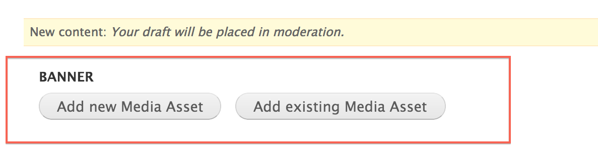
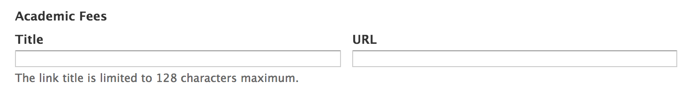

# Programs

* [What are programs?](#what-are-programs)
* [Creating programs](#creating-programs)
* [Updating programs](#updating-programs)
* [Deleting programs](#deleting-programs)
* [Changing program layouts](#changing-program-layouts)
* [Adding widgets to programs](#adding-widgets-to-programs)

## What are programs?

Programs are a **content type** that represent the programs/majors inside your college. 

## Creating programs

### 1. Open the 'Create program' form
In the Administration Menu, navigate to:
	
	Content > Add content > Program
		

### 2. Add a banner
Add a new or existing [Banner Slide](banner-slides.md).

### 3. Choose a program name
Enter the **Program Name** for this program.

### 4. Choose a shortened program name
Enter the **Shortened Program Name** for this program.

This short name will be used in the program's url and other areas around the site. 

An **example** of a shortened name for the <i>Graphic Design Concentration</i> would be <i>Graphic Design</i>

### 5. Add copy
Enter the **Description** of this page. This is the main copy of your program. 

Using the editor toolbar, you can add images or format your copy.

### 6. Add Required Courses

Using this field allows you to link to an external/internal page that holds information about a course that is required for this program.

### 7. Add Academic Fees

Using this field allows you to link to an external/internal page that holds information about fees that are required for this program.

### 8. Add Careers

Using this field allows you to enter careers associated with this program.

### 8. Add Accredidations

Using this field allows you to enter accreditations associated with this program.

### 9. Add Financial Aid & Scholarships

Using this field allows you to enter financial aid and scholarship information associated with this program.

### 10. Add Further Information

Using this field allows you to enter further information associated with this program.

### 11. Select Program Type

Select the **Program Type** of this program/major.

### 12. Select Program Level

Select the **Program Level** of this program/major.

### 13. Select Department

Select the **Department** of this program/major. The Departments listed in this drop-down will be automatically updated with departments that have been created for your college. See [Departments](content-department.md) for more info on creating Departments.

### 14. Menu settings

Choose a **Menu link title** which will be the name of the menu item displayed.

More detail on the remaining items in this section can be found in the [Menu settings]() documentation.

## Updating programs

### 1. Create a new draft

While viewing the program, click the **New draft** tab located at the top of the page.

### 2. Make changes

Updating a program is very similar to [Creating a program](#creating-programs). Make the changes you want and then click the **Save** button located at the bottom of the form.

## Deleting programs

### 1. Open a new draft

While viewing the program, click the **New draft** tab located at the top of the page.

### 2. Delete the program

At the bottom of the **New draft** form, click **Delete**.

### 3. Confirm deletion

Confirm the deletion by clicking the **Delete** button.

## Changing program layouts

### 1. Change the layout

On the program you want to change the layout for, click the **Change this layout** button located at the bottom of the page.

### 2. Choose a layout

Select the layout you would like for this program.

### 3. Approve content locations

Move content around and once you are satisfied, click **Save**. 

## Adding widgets to programs

### 1. Customize the page

On the program you want to customize, click the **Customize this page** button located at the bottom of the page.

### 2. Update the content

Make the changes that you want. 

For a more detailed tutorial, please read [Customizing Pages]()

### 3. Save your changes

Once you are satisfied with the changes, click **Save**. 

