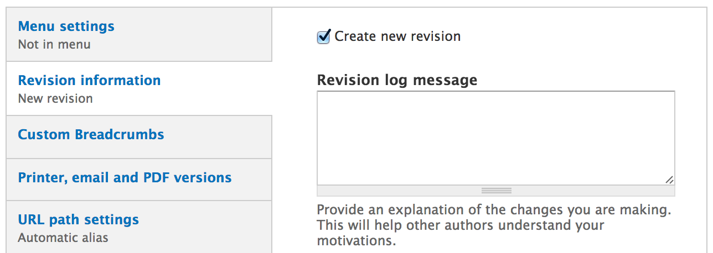
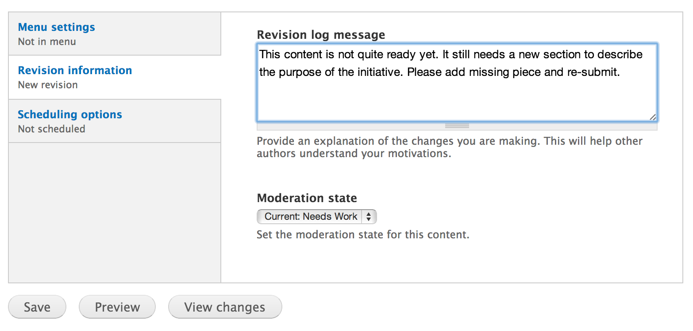
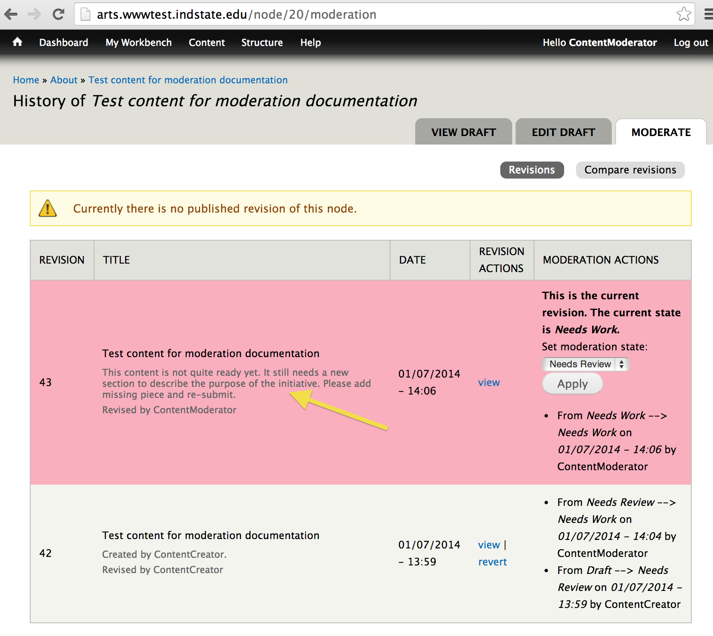
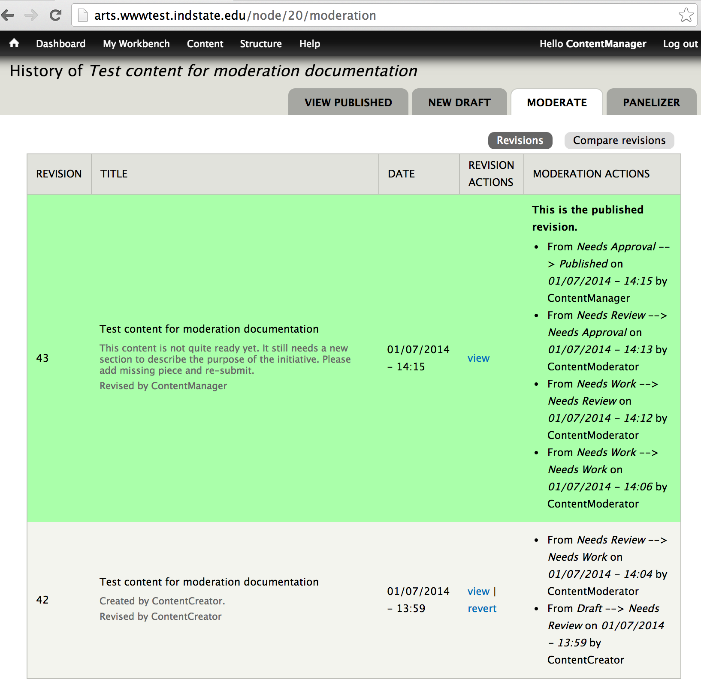
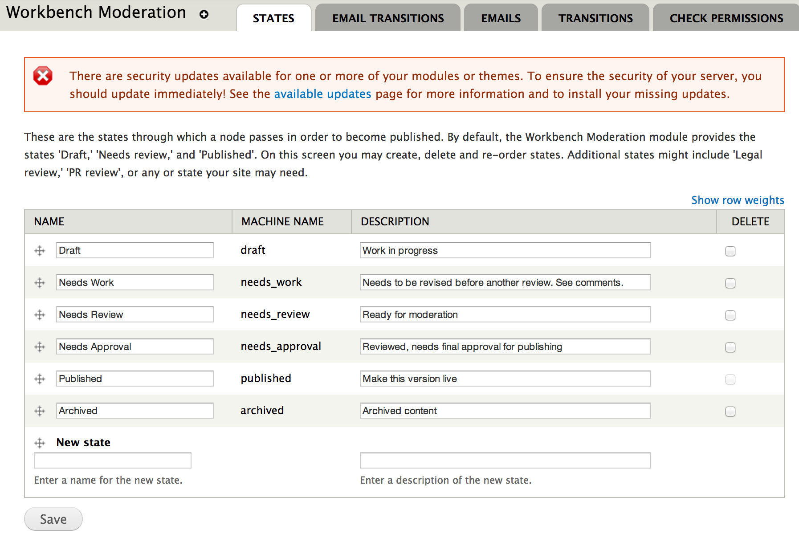
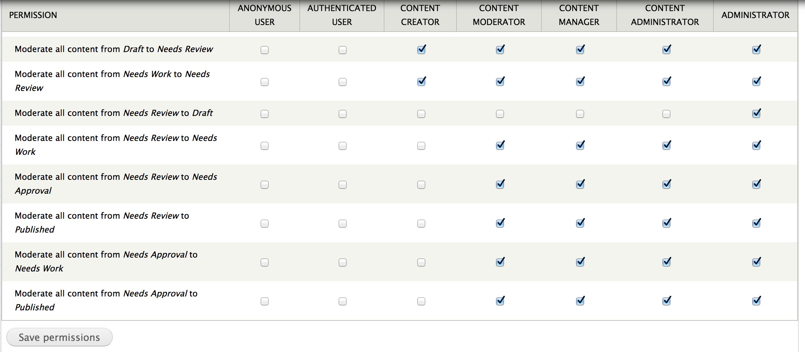

# ISU College Sites
***

# Content Moderation

1. [What's moderation?](#whats-moderation)
2. [How does it work?](#how-does-it-work)
3. [A workflow scenario](#a-workflow-scenario)
4. [Administering states and transitions](#administering-states-and-transitions)
5. [Administering email notifications](#administering-email-notifications)

## What's moderation?

Content moderation is the ability to setup and maintain an editing workflow for content that's created for the site. The purpose is to have a defined set of steps that content should go through before it is eventually published to the site. This helps with managing control over the content that's published to the site by maintaining a structure and set of logic over who can publish content and how it can be published.

It can help to ensure that more than one person reviews content for things like typos, style guide, and content strategy to help produce higher quality content. It can help to enforce a set of standards around how content gets published to the site. It can help to enforce an approval process for content publishing. And it can help to manage the editing and moderation process to facilitate improving and keeping track of content in progress.

## How does it work?

By default Drupal has a rudimentary form of content moderation. Any piece of content has a couple of states it can be in at any given time: `draft` and `published`. This allows content to be edited and saved before it is published, and keeps content from being publicly visible until it is published. This also enables the ability to create and save distinct versions of drafts that are stored as revisions. When a new revision is created and saved, it's stored separately in the database and it can be retrieved, viewed, and reverted at a later state.

For the ISU sites, this default moderation setup is enhanced by implementing a community contributed module called "Workbench Moderation". Workbench Moderation adds an infrastructure for configuring additional moderation states and providing specific workflow around moderation states. Therefore, by default on the ISU sites there are four additional states to the two default states:

- `Draft` -  Work remains unpublished and is a work in progress.
- `Needs Work` - Work remains unpublished, has already been submitted for review, and a reviewer has moderated it and found it to be not ready yet. Typically the original author would need to improve it and re-submit by saving it once more to `Needs Review`.
- `Needs Review` - Work remains unpublished, the author has completed the piece of content and is ready for it to be published.
- `Needs Approval` - Work remains unpublished, the reviewer has moderated the content and has marked it for final approval before publishing.
- `Published` - Work is now published, having been reviewed and approved by individuals with the appropriate permissions.
- `Archived` - Work remains unpublished, the content was once published and is no longer in use, but needs to remain in the site instead of being deleted.

According to these sensible defaults, an individual piece of content would go through the following states through its life-cycle:

`Draft` -> `Needs Review` -> `Needs Approval` -> `Published`

It may also get pushed back to `Needs Work` if a reviewer does not approve the content, as well as being placed in `Archived` state if the content is no longer needed.

In addition to providing new states, Workbench Moderation forces all saved content to be saved as a new revision, adds custom workflow utilizing these states, and provides an interface for viewing the moderation steps of individual pieces of content.

Despite these additional states, it's not necessary for all pieces of content to go through each of these steps before it can be published. As with everything in Drupal, ability of an individual user is controlled by permissions. This means that a sufficiently privileged user can skip over states and publish content without following the prescribed workflow when necessary. The purpose for states and workflow is to provide artificial constraints to users so that you can maintain high quality content.

## A workflow scenario

With the defaults setup for the ISU sites, the most involved content moderation workflow to get a piece of content published would involve three individuals and five moderation states. In this scenario, we'll assume we have three roles:

- content creator
- content moderator
- content manager

***
***

1. The content creator creates a piece of content and saves it. She comes back the next day and edits her draft, finalizing it for publishing. She saves the finalized draft to the `Needs Review` state.

    

    You'll notice here that the content creator does not have all states available to her. In fact, she can only save content as a `Draft` or as `Needs Review`.

2. The content moderator is notified and sees that the content creator has a new piece of content and has saved it as `Needs Review`. The content moderator reviews the content, improves a few typos, but still finds it in need of improvement. The content moderator saves it as `Needs Work` and adds notes about what needs to be improved.

    

    Notice that adding the revision notes about what needs to be done next will pass those notes back to the content creator so she'll know what needs to be done.

    

    Each piece of content now has a "Moderate" tab that provides an interface to see the revisions of the content and how it's transitioned through states. It also includes the revision message and metadata about who moderated it and when.

3. The content creator is notified that her content still needs improvement, fixes up the problems, and once again saves it as `Needs Review`.
4. The content moderator receives the content once more, reviews it, and feels that it's ready to be published. She saves it as `Needs Approval`.
5. The content manager is notified that there is content ready for final approval, sees the new content, and approves it. At this point the content manager saves it as `Published`, and the content is then live on the site.

    

This scenario covers a robust workflow whereby three individuals must review each piece of content before it can be published. However, in some scenarios this may be overkill. For that reason, it is also possible to simplify this workflow by not using the `Needs Approval` state, and simply going directly from `Needs Review` to `Published`.

## Administering states and transitions

The default states are setup to be sensible, but additional states can be created by users with administrative privileges to do so. Workbench Moderation has its own configuration pages.

/admin/config/workbench/moderation

On the States page you can see the existing moderation states and their descriptions. It's here that you can also add new states for moderation. The name and description are purely semantic, meaning that they're technically arbitrary and their purpose will be defined based on what you decide their purpose should be.

How a state works is largely defined by the transitions that you define for it. On the Transitions page, you can set how the state is allowed to transition to and from other states. If you state doesn't contain a transition from another state, the state won't be able to be applied to the content when it's currently in the other state.

The last piece to the puzzle is to configure permissions for the states and transitions. Just creating and state and setting up transitions generates the structure, but it's through user permissions that you define who can and cannot use those states and transitions. By navigating to the user permissions page and selecting the Workbench Moderation section, you can modify those permissions.

/admin/people/permissions

## Administering email notifications

The moderation of content can be setup to send emails when content is transitioned from one state to another. For this functionality, there is an "Email Transitions" page to configure what transitions should trigger email notifications.

Once a transition is selected, the Emails tab can be used to configure the subject and body message of the email that will be sent when the transition occurs.

When a user creates a piece of content and transitions it from a state to another state that has an email transition setup for it, she will be given a list of users based on the role assigned to the email transition who she can select from to send the email notification to.

Created on January 6, 2014 
Last modified on January 7, 2014 
Authored by Kevin Champion

