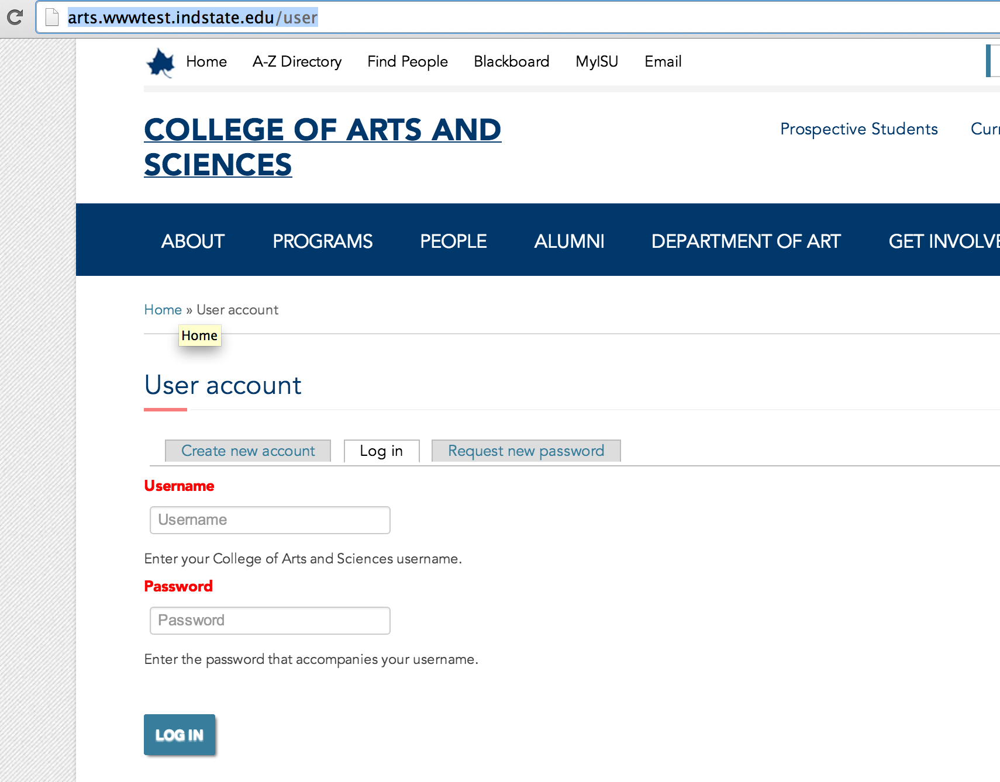

# ISU College Sites
***

# Logging in and administration

1. [Login](#login)
2. [Administer](#administer)
3. [Logout](#logout)

## Login

In Drupal there is always a path you can navigate to in order to log in.

/user

As a result, to log in to one of the college sites, you'd navigate to one of the following:

- [arts.wwwtest.indstate.edu/user](http://arts.wwwtest.indstate.edu/user)
- [business.wwwtest.indstate.edu/user](http://business.wwwtest.indstate.edu/user)
- [education.wwwtest.indstate.edu/user](http://education.wwwtest.indstate.edu/user)
- [nursing.wwwtest.indstate.edu/user](http://nursing.wwwtest.indstate.edu/user)
- [technology.wwwtest.indstate.edu/user](http://technology.wwwtest.indstate.edu/user)

On the Indiana State University college sites there is no button or other navigational element that will help you get to the login page, so you'll need to commit this path to memory or bookmark it to get to it in the future.

Once on the login page, you simply enter your username and password. Built into Drupal is the ability to recover from a lost or forgotten password as well by using the "Request new password" tab.

If you have trouble logging in, you'll need to contact an admin to iron out the problem.

## Administer

User Alerts have their own content type named "User Alert". All published user alert nodes will display to all users with the appropriate permissions to view user alerts. This means that the process of displaying and hiding user alerts is a matter of publishing and unpublishing nodes. The site may have un-limited number of user alerts published and unpublished at any time. This may be helpful in particular to be able to save generic or recurring alerts in the site so that they can be used again at a later date, or simply reviewed in the process of creating a new alert.

Creating a new user alert is as simple as creating a User Alert node:

[/node/add/user-alert](http://cms.indstate.edu/node/add/user-alert)

The user alert content is comprised of a title and body field, and the form has a number of additional configuration fields.

## Logout

There are two different types of user alerts. To select the type of user alert there is a "View type" field that defines the user alert type.

Created on January 6, 2014 
Last modified on January 6, 2014 
Authored by Kevin Champion

