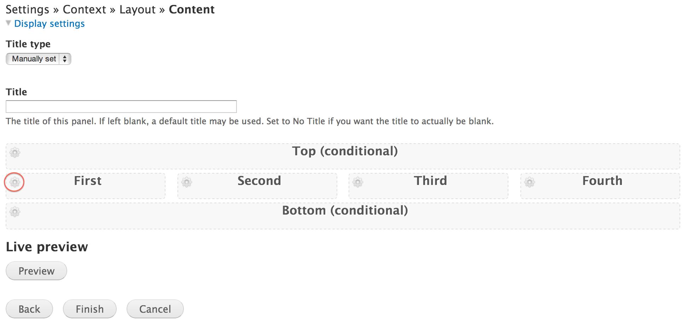
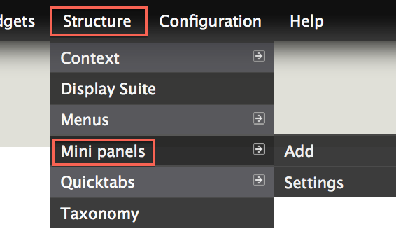

# Mega Menu

* [What is a mega menu](#what-are-pages)
* [Creating a mega menu](#creating-pages)
* [Updating a mega menu](#updating-pages)

## What is a mega menu?

A mega menu is a [Mini Panel](mini-panels.md) that is placed inside of a [Menu](menus.md). A [Mini Panel](mini-panels.md) is a block of content which can consist of images, links, or copy.

Below is an example of a Mega Menu attached to the site's Main Menu.

[add image last - showing the finished product]

## Creating a mega menu

### 1. Create a new mini panel

We will not go into detail with what [Mini Panels](mini-panels.md) are, but instead give a brief overview on how to create a Mini Panel for this tutorial.

In the Administration Menu, navigate to:
	
	Structure > Mini panels > Add
		

Enter the **Administrative title** for this mini panel. The title will only be used to identify this mini panel for configuration purposes.

You may want to enter a **Administrative description** especially if you are creating a lot of similar mini panels.

Type in **Mega Menu** as the **Category**. While typing, it should auto-populate with **Mega Menu** for you as seen in the image below.

Click **Continue**

Don't be overwhelemed by the next screen. Just click **Continue**.

Next, select the layout for this mini panel. Remember, a mini panel is like a block of content that is not the size of a full page.

Once you've selected the layout click **Continue**

In this example, I've selected a four column layout. 

In the **First** column, click the gear icon and select **Add content** 

For this example, I've already created some example [Blocks](blocks.md) so we will be adding those to our mini panel.

The first block to add is under the **Blocks: Basic Block** section and is called **About Image**.

[image]

Click the **Add** button to add this block to our mini panel.

[image]

We don't want the title of this block to appear in our mini panel so click the **Override title** checkbox and leave the text field blank. This will override the title with a blank title.

Click **Save** to continue.

[image]

Next click the **Second** column gear icon to add content into this column.

[image]

The second block we will add is under the **Blocks: Basic Block** section and is called **About the College**.

[image]

Click the **Add** button to add this block to our mini panel.

[image]

Click **Save** to continue.

[image]

Continue the process for the next two columns.

### 2. Save the mini panel to the menu item

In the Administration Menu, navigate to:
	
	Structure > Menus > Main menu
	
Locate the **About** menu item and click **edit** under the **OPERATIONS** column.

[image]

Locate the **Mega menu** selector and choose **About**

[image]

Click **Save** to continue

[image]
	
### 3. Go look at the main menu!

It should now have the **About** mini panel that you created inside on hover of the **About** menu item.

[image]

## Updating a mega menu

### 1. Load the Mini Panel you want to edit

In the Administration Menu, navigate to:
	
	Structure > Mini panels
	
	

Find the Mega Menu mini panel you would like to edit and click the **Edit** link under the **OPERATIONS** column.

	

If you are wanting to update the content within this mini panel, click on the **Content** link identified in the image below.

	

Make your changes and be sure to click the **Save** button when you are finished.

