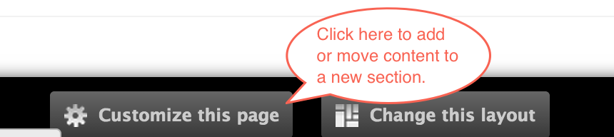
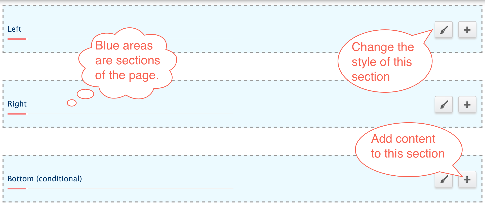
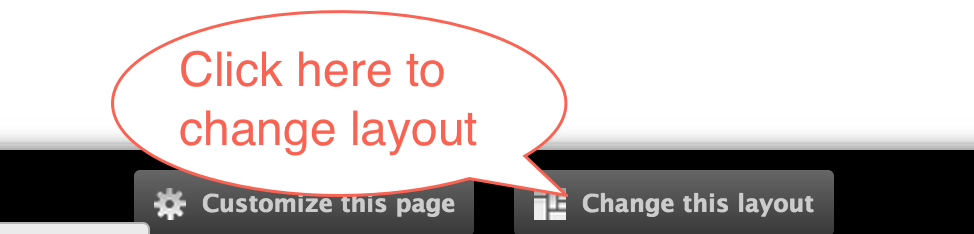
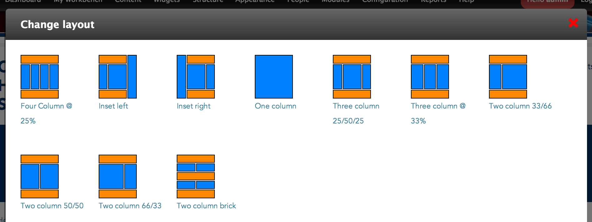

# Updating Page Content and Layout using Panelizer

* [How to add or remove content on (customize) a page](#how-to-add-or-remove-content-on-customize-a-page)
	* [Page sections](#[page-sections])

	* [Reusable content types](#reusable-content-types)

* [How to update a page layout](#how-to-update-a-page-layout)

## How to add or remove content on (customize) a page 
Most pages that you find on the site can be customized. Reusable content can be added, removed, or assigned to different regions of a page.

In order to determine if a page can be customized, look for the buttons **Customize this page** and **Change this layout** located on the bottom of the page.

Click **Customize this page** to update the content located on this page.

### Page sections

Depending on a page's layout, there could be many sections of a page: Top, bottom, left, right and middle. It's not uncommon to see a left below or right below section as well.

Located at the top right of each section are two buttons with two specific purposes:

* The **paint brush** controls the **style** of the section.

* The **add/plus sign** lets you **add content** to the section.
 

### Reusable content types

Only certain content can be added to sections of a page. Reusable content such as blocks, widgets, images, etc are examples of reusable content. If you created a piece of content on the site, chances are you can add it to a section in a page.

Clicking the **add/plus sign** allows you to add content to a section. Content is categorized based on type. In most cases, Blocks and Miscellaneous type content will be the main categories you will be searching for content.

## How to update a page layout

At the bottom of the page, click **Change this layout**.

If you are able to update the layout, there will be some additional layout options to choose from.

Select the one you want by clicking on it.

Because your layout has changed, you will have to go into **Customize this page** in order to move content around to their new section.

