# ISU College Sites
***

# Section control

1. [What's section control?](#whats-section-control)
2. [How does it work?](#how-does-it-work)
3. [Administrative configuration](#administive-configuration)

## What's section control?

By default, Drupal manages user privileges by a combination of [user roles and permissions](login_administer.html). While user permissions allow for a high degree of granularity in setting up access controls, they do not inherently provide any mechanism for providing access controls on content based on how and where it's published in the site.

For example, you may have an "About" section on the site and you want to grant a user or group of users the ability to create and edit content in the "About" section of the site, but nowhere else. This type of section access control is not built in by default because there are a multitude of ways that content can be structured on sites and there's no clear unified use-case for how to implement it. Nonetheless, the Drupal community has contributed many modules that attempt to tackle section access control in a variety of ways.

For the ISU College sites, this is handled by a module called "Workbench Access". Workbench Access allows the site to manage section access control based on the menu system, which handles the above scenario of restricting user access to different parts of the site's main menu. This allows you to assign users to sections in the site, based on the menu, which effectively restricts them from editing other sections. For ISU College sites, this will be particularly important for assigning department content editors and administrators to their own department sections of the site.

## How does it work?

Administrators with sufficient permissions to configure section access control will visit the Workbench Access configuration pages to assign individuals and entire roles to sections of the site.

/admin/config/workbench/access

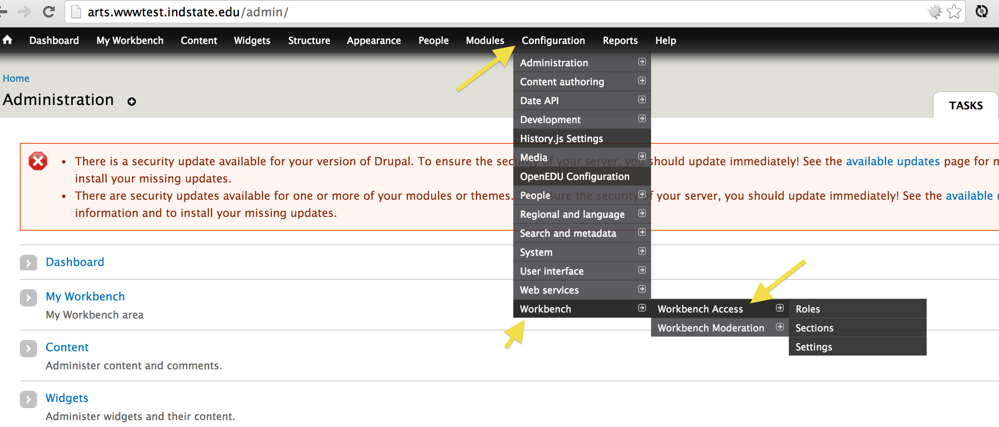

The Workbench Access configuration has two main relevant sections for configuring section access control: Editors and Roles.

### Editors

On the Editors tab, you can see a list of all the sections in the site that are eligible to assign users to. These "sections" are actually just pages that have been placed in the main menu hierarchy of the site (which categorizes the majority of content in the site). In the Editors table, there is a column titled `Editors`, which contains a link to configure individual users who can edit that particular section of the site.

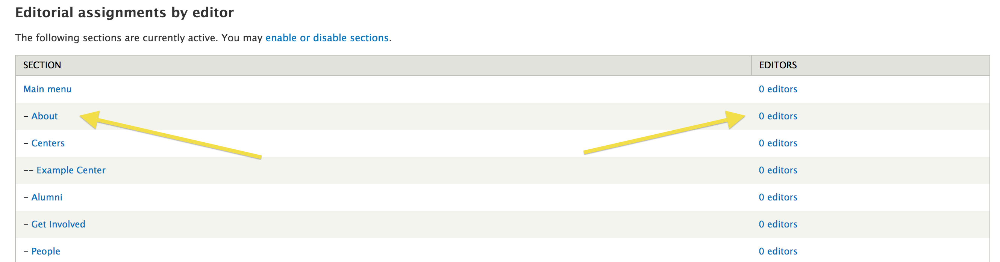

If you enter a particular section by clicking that link, you are given a form in which you can add users to that section. Once added, the user will be able to create and edit content in that section of the site to whatever degree/level of permissions the user has been granted based on the user's assigned role/s.

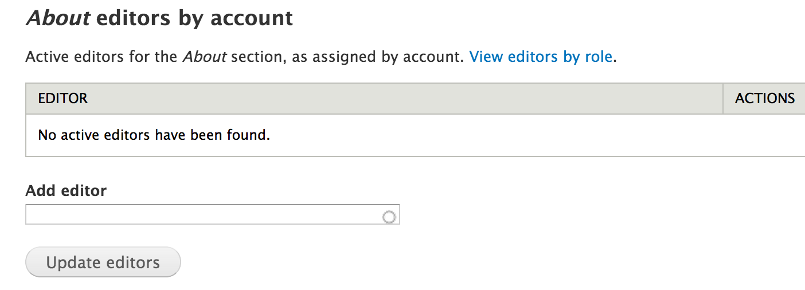

### Roles

On the Roles tab, you can see a list of all the sections in the site that are eligible to assign users to, just like on the Editors tab. However, in the Roles administration section when you enter a particular section of the site, you are able to assign entire user roles to the section, rather than just individual users.

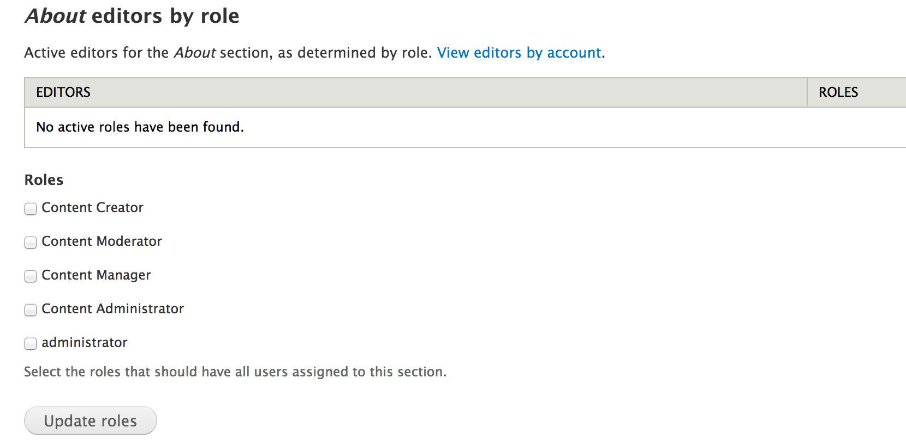

***
***
***
***

Precedence with Workbench Access section control works just the same way as it does on user roles and permissions. The more permissive configuration takes precedence over the more restrictive configuration. For example, if a user is assigned to the /about section of the site, that user will also have access to any sub-sections within the /about section of the site.

You'll notice this in the default configuration. By default, the college sites are setup so that the parent section of the site containing the entire main menu has the Content Manager, Content Administrator, and Administrator roles assigned to it. What this means is that any users assigned any of those three roles have access to all sections of the site, no matter what other additional sections those users and roles are added to.

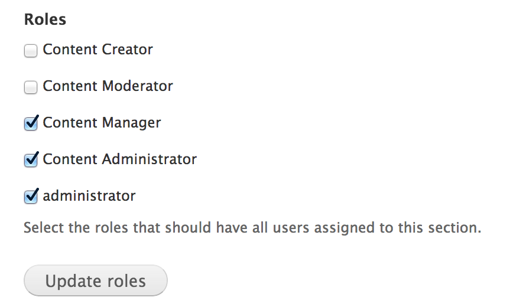

### My Workbench

Individual users will have a section of their own administrative pages dedicated to their account that's labeled `My Workbench`. One of the pages in `My Workbench` is called `My Sections` and lists the sections of the site that you have been granted access to. For instance, the following is a user who was granted access to the "About" section of the site:

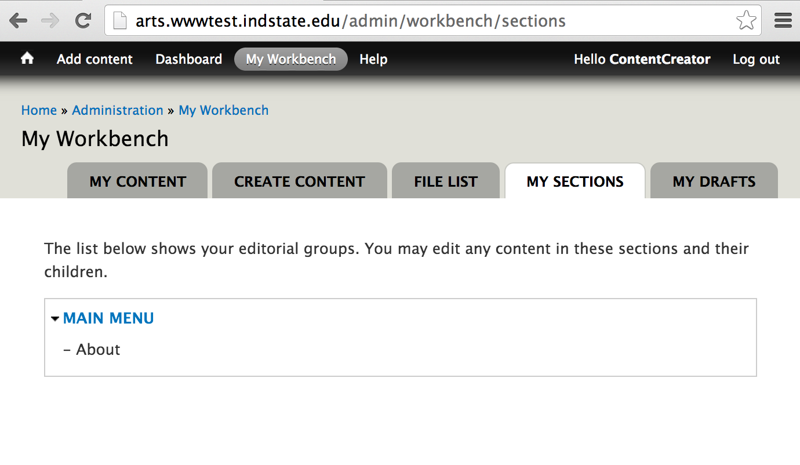

## Workbench Access administrative configuration

Workbench Access has a settings tab that configures how it should work.

There are two modes that determine how sections are defined in the site, Menu and Taxonomy. ISU College sites and ISU primary site uses the Menu system to define sections.

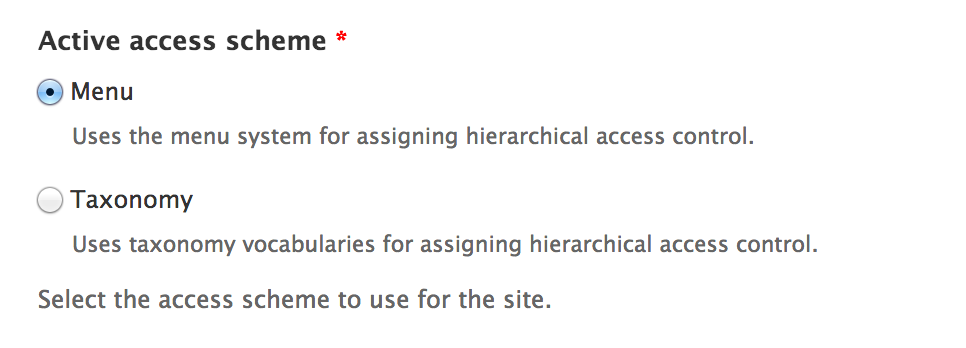

When the menu scheme is in use, there are menu scheme specific settings that define the menu to use for section definition and how users can work with the menus. For the ISU sites, the main menu is used as a centralized hierarchical organization structure, and due to this the main menu works really well for section definition and access control.

The two additional settings help content editors to place their content in the correct location in the menu system. The first `Limit available menu items based on Workbench Access` restricts the menu options within which editors can place content, and the second `Permissions override for creating new menu items` allows for more granular permissions so that users can place content in the main menu without having to have administrative permission for the entire menu system.

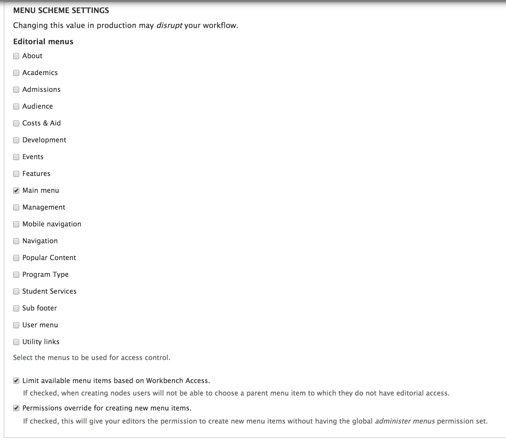

The settings have a section for enabling/disabling each content type, which controls whether or not content in it should be restricted by Workbench Access. Some content types perform specialized functionality and they're already restricted to administrative users anyway, so it's not necessary for them to be additionally modified by Workbench Access.

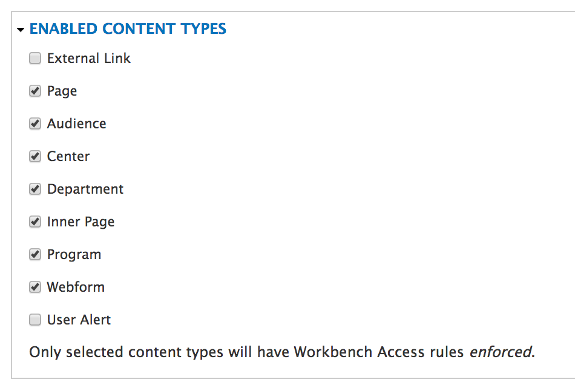

Lastly, at the bottom of the settings page there are a few final settings. The `Automated section assignment` setting makes it so that as new sections of the site are created, they are automatically added as options for section access control using Workbench Access. The `Allow multiple section assignments` setting enables the ability to place an individual piece of content in more than one section of the site. And the `Require a Workbench Access form element` setting determines if a separate form element should be used on each piece of content to allow content creators to manually place it in a section. In the ISU College sites, this is not necessary because the section it is placed in is being determined by the menu location of the content.

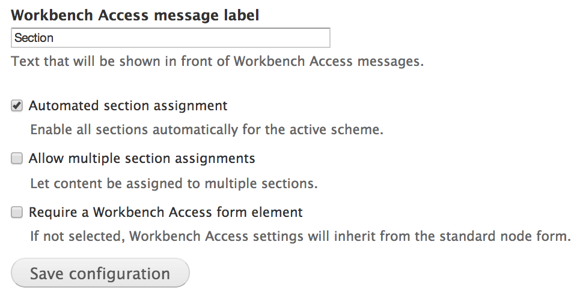

### Workbench Access permissions

Workbench Access has its own permissions, which determine how users can interact with it.

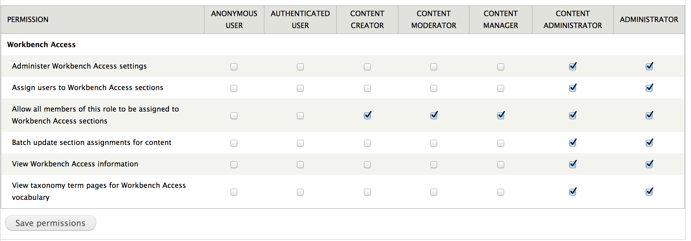

Created on January 6, 2014 
Last modified on January 7, 2014 
Authored by Kevin Champion

