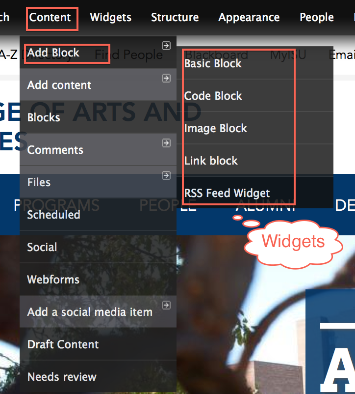
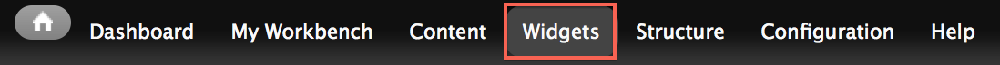
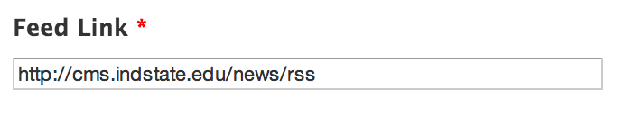
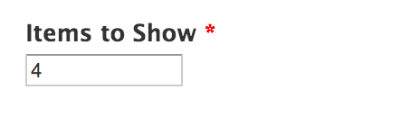
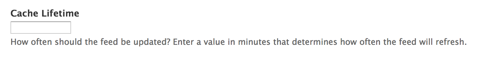

# Widget Blocks

* [What is a widget](#what-are-widgets)
* [Adding a widget](#adding-a-widget)
* [Basic Blocks](#basic-blocks)
* [Image Blocks](#image-blocks)
* [Code Blocks](#code-blocks)
* [Link Blocks](#link-blocks)
* [RSS Feed Widgets](#rss-feed-widgets)

## What is a widget?

A widget is a [block](blocks.html) of content that can be placed on any page on the site. When you create a widget, it can be used as a block, meaning that it can be placed in a region of the site and shown using standard visibility settings. It can also be placed in a mini-panel or in [panelizer](panelizer.html) on an individual page.

There are different types of widgets:

* **Basic block**: Static content which can include copy, links, or media embeds.
* **Image block**: A single image. Used with mini panels.
* **Code block**: Expert use only! Add javascript or php to pages.
* **Link block**: A single link to an external or internal page.
* **RSS Feed Widget**: Shows results from RSS feeds. Used to display News and Events from the main ISU site.

## Adding a widget

In order to add a new widget, you will have to create a new instance of one.

In the Administration Menu, navigate to:

	Content > Add Block > [Type of widget]

## Updating a widget

In the Administration Menu, navigate to:

	Widgets

Select the widget you want to update, and click **edit** under the **OPERATIONS** column.

## Basic Blocks
**Basic Blocks** allow content authors to create simple text and HTML markup to be placed within and rendered using a formatting toolbar.

## Image Blocks

**Image Blocks** allow content authors to create a block which consists of a single image.

## Code Blocks

**Code Blocks** allow content authors to insert javascript or php into the page. This action should only be completed by advanced users.

## Link Blocks

**Link blocks** allow content authors to create a block of links. Links are displayed in a simple vertical list.

## RSS Feed Widgets

**RSS Feed Widgets** allow content authors to create a block of rss items (results). RSS results are displayed in a simple vertical list.

Below is an example of an RSS Feeds Widget that pulls in news items from the primary ISU site.

### Widget Options

**Feed Link** is the main source of the RSS feed. Enter the RSS Feed's url here.

**Items to Show** determines how many items will be displayed in the block.

**Cache Lifetime** is a numeric value represented in minutes that determines how often the RSS feed should refresh.

**Hide Title** toggles whether or not the RSS feed item's title should be displayed in the results.

Created on January 8, 2014 
Last modified on January 8, 2014 
Authored by Gray Sadler

